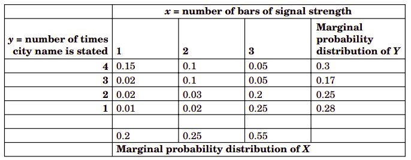

# 5、联合概率分布

在第3章和第四章研究的概率分布都是指间一随机变量的分布。但是有时为了描述一个事物，可能需要两个以上的随机变量，比如空气质量的问题。要描述空气质量，必须要描述它的颗粒物质(比如PM10)和臭氧的含量。这两个指标会同时受到几个因素的不同影响，因此，它们的分布是比此相关的，比如如果测得PM10上升，则臭氧浓度也可能上升，因此需要研究它们的共同概率。另外一个例子就是混凝土的立方抗压强度与耐久性两大类性能的相互影响。中国高速铁路混凝土的耐久性要求有多个指标，比如反映氯离子渗透的混凝土电通量指标。混凝土的抗压强度和电通量的测量值同样是随机变量。高速铁路混凝土往往对电通量的上限有一定的限制。但是，水胶比、减水剂用量、矿物外掺数的用量、砂率等等因素都对混凝土的也结构有重大影响，水胶比还直接影响混凝土立方抗压强度，并且是主要影响因素。当水胶比降低时，混凝土的立方抗压强度会提高，同时混凝土的电通量会降低。种种因素都要求我们去研究在共同因素的作用下，两个随机变量的概率分布的性质。这是本章要解决的问题。

## 5.1、两个或多个随机变量

在[第3章](third.md)和[第四章](fourth.md)我们研究了单一随机变量的概率分布。但是在随机实验中往往需要定义多个随机变量。比如空气质量的研究中，往往至少需要定义它的PM10和臭氧浓度。我们生产的混凝土原材料也需要两个以上的指标，比如水泥。我们关心水泥的早期强度，也关心它的需水量(用标准稠度用水量量化）。水泥的需要量指标标准稠度用水量都与水泥的早期强度都受水泥细度的影响。因此，当我们测量早期强度增高时，有可能它的标准稠度用水量也会增高。

这样的实例有很多。在高速铁中大建设时期，要求它的混凝土是高性能混凝土，混凝土结构使用寿命需要100年。为此要限定混凝土的某些耐久性指标，比如反映氯离子渗透性能的电通量。如果我们用随机变量$X$表示混凝土的立方抗压强度，用$Y$表示它的电通量指标。由于减水剂用量、矿物外掺料的品种及用量都会改变混凝土内部毛细孔的孔径分布，因此为改变电通量的大小。特别是矿物外掺的作用可以持续相当相当长的一个日期(比如50年)，它即会不断地改进毛细孔的结构，也会改进混凝土的立方抗压强度，这种因素会同时影响两个随机变量。同样的，水胶比也能影响早期的混凝土强度，影响毛细孔的总体积率，这也会对抗压强度和电通量产生影响。这些影响究竟如何呢？需要我们去研究$X$和$Y$的概率。比如，如果$X$的范围在$[30, 70]$MPa，$Y$的范围在$[300, 2800]$库伦。我们可会关心$P(30<X<70\text{和}300<Y<2800)$。

因为我们对一批生产的混凝土同时取样制作立方抗压强度试件和电通量用试件，因此材料和配合比是相同的，材料和生产过程的波动会同时影响这两种试件的抗压强度和电通量测量值。所以，我们希望抗压强度要高，同时还希望电通量要小。

一般地，如果$X$和$Y$是两个随机变量，定义它们的共同行为的概率分布就称为**联合概率分布**。这是本章要研究的主要内容。
### 5.1.1、联合概率分布

为了简化，我们从两个随机变量的随机实验开始研究联合分布，然后再推广到多于两个随机变量的联合概率分布。

如果$X$和$Y$是离散随机变量，那么它们的联合概率分布可以用在范围$(X, Y)$内所有的点$(x,y)$及所对应的概率来描述。有时我们又称两个随机变量的联合概率分布为**双变量概率分布**或**双变量分布**。也可以使用联合分布质量函数来描述两个离散随机变量的联合分布。同时为了简化，我们把概率$P(X=x\text{和}Y=y)$简写为$P(X=x,Y=y)$。

!!!note "联合概率质量函数"
    随机变量$X$和$Y$的**联合概率质量函数**$f_{xy}(x,y)$需要满足：

    $$
    \begin{align}
    (1)&\qquad f_{xy}(xy)\leq 0\nonumber\\
    (2)&\qquad \sum_{x}\sum_{y}f_{xy}(x,y)=1\nonumber\\
    (3)&\qquad f_{xy}(x,y)=P(X=x,Y=y)\qquad
    \end{align}
    $$

对于单一随机变量的质量分布我们假定在它的取值范围之外的概率都为零，对于多元随机变量也一样，在所有随机变量的取值范围之外的概率也为零。这是概率质量函数的特点。

两个以上的连续随机变量组成一个二维的连续空间。在这个空间上它的**联合概率分布密度函数**，通过密度函数即可以求得任意区域$R$上的概率。联合概率密度函数在任意区域$R$上的二元积分即是这两个连续随机变量在$R$上的概率。这个概率还可以解释为概率分布密度曲面在$R$上围成的体积。

!!!note "联合概率密度函数"
    用$f_{XY}(x,y)$表示连续随机变量$X$和$Y$的**联合概率密度函数**，它应该满足：

    $$
    \begin{align}
    (1)&\qquad \text{对于所有x,y}\qquad f_{XY}(x,y)\geq 0 \nonumber\\
    (2)&\qquad \int\limits_{-\infty}^{\infty}\int\limits_{-\infty}^{\infty}f_{XY}(x,y)dxdy=1\nonumber\\
    (3)&\qquad\text{对于二维空间上的任意区域R：}\nonumber\\
    &\qquad\qquad P((X,Y)\in R)=\int\limits_{R}\int f_{XY}(x,y)dxdy\qquad\qquad\qquad
    \end{align}
    $$

### 5.1.2、边缘概率分布

在随机实验中如果定义了两个及两个以上的随机变量，一个非常重要的问题就是区分$X$和$Y$的联合分布和各个变量的单独分布。随机变量的单独概率分布指的是它的**边缘概率分布**。

一般地，随机变量$X$的边缘概率分布可以由$X$与其它变量的联合概率分布求得。比如，设想随机变量$X$和$Y$，为了确定$P(X=x)$的概率，只需要固定$X=x$加总所有的$P(X=x,Y=y)$的概率。即：

$$
P(X=x)=\sum\limits_{y}P(X=x,Y=y)
$$

!!!note "实例5.1"
    下表为连续随机变量$X$和$Y$的联合概率质量函数。试求$P(X=3)$的值。
    
    
    $$
    \begin{align}
    P(x=3)=f_{X}(3)&=P(X=3,Y=1)+P(X=3,Y=2)\nonumber\\
    &\qquad+P(X=3,Y=3)+P(X=3,Y=4)\nonumber\\
    &=0.25+0.2+0.05+0.05=0.55\nonumber
    \end{align}
    $$

从实例5.1中的概率质量函数表，可以分别加上$X$取某一值的列的所有概率质量函数值求得$X$取该值的概率，并写在表格的边缘。同样地，分别加上$Y$取某一值的行的所有概率质量函数值可以求得$Y$取该值的概率，也写在表格的边缘。正是因为这些概率写在表格的连续，所以早期就被称为为边缘概率。

对于连续随机变量，仍然是求和的概念，只是要用积分求和，所以有：

!!!note "边缘概率密度函数"
    连续随机变量$X$和$Y$的联合概率密度函数为$f_{XY}(x,y)$，则$X$和$Y$的**边缘概率密度函数**分别为：

    $$
    \begin{equation}
    f_{X}(x)=\int\limits_{y} f_{XY}(x,y)dy\qquad\text{和}\qquad f_{Y}=\int\limits_{x}f_{XY}(x,y)dx\qquad
    \end{equation}
    $$

    其中，第一个积分是针对$X=x$时所有$(X,Y)$的积分，第二个积分是针对$Y=y$时对所有$(X,Y)$的积分。

### 5.1.3、条件概率分布

两个随机变量的联合概率分布在本质上指的是在它们的取值空间中同时满足某一个条件的概率，其概率的完整地书写为$P(X=x and Y=y)$，在逻辑上两者是“与”的关系。而条件概率又有不同，它是指在某一个条件成立的前提下，随机变量取某一个值时的概率。考虑两个随机变量，则它应该是$P(X=x|Y=y)$。

还记得事件$A$和$B$的条件概率$P(B|A)=P(A\cap B)/P(A)$。将它应用到两个随机变量上，只需要将$X=x$和$Y=y$定义为对应事件$A$和$B$即可。

!!!note "实例5.2"
    仍然以实例5.1的数据为例。我们要求$P(Y=1|X=3)$的概率。我们定义事件$X=3$为事件$A$，$Y=1$为事件$B$。则有：

    $$
    \begin{align}
    P(Y=1|X=3)&=P(X=3,Y=1)/P(X=3)\nonumber\\
    &=f_{XY}(3,1)/f_{X}(3)=0.25/0.55=0.454\nonumber
    \end{align}
    $$

    同理可以得到：

    $$
    \begin{align}
    P(Y=2|X=3)&=P(X=3,Y=2)/P(X=3)\nonumber\\
    &=f_{XY}(3,2)/f_{X}(3)=0.2/0.55=0.364\nonumber
    \end{align}
    $$

    还可以求得$P(Y=3|X=3)=0.091$以及$P(Y=4|X=3)=0.091$。还需要注意，$P(Y=1|X=3)+P(Y=2|X=3)+P(Y=3|X=3)P(Y=4|X=3)=1$。这四个概率定义了在给定$X=3$时的$Y$的概率分布。

因此，我们可以认为在给定$X=x$的前提下定义的$Y$的条件概率是一个新的概率分布。

!!!note "条件概率密度函数"
    设连续随机变量$X$和$Y$，它的联合概率密度函数为$f_{XY}(x,y)$，则在给定$X=x$的前提下$Y$的**条件概率密度函数**为：

    $$
    \begin{equation}
    \text{对于}f_{X}(x)>0\qquad f_{Y|x}(y)=\frac{f_{XY}(x,y)}{f_{X}(x)}\qquad\qquad
    \end{equation}
    $$

条件概率密度函数提供了在给定$X=x$条件下$Y$的条件概率。

!!!note ""
    因为条件概率密度函数$f_{Y|x}(y)$是在$R_x$上所有$y$的概率密度函数，所以它满足以下关系：

    $$
    \begin{align}
    (1)&\qquad f_{Y|x}(y)\geq 0\nonumber\\
    (2)&\qquad \int f_{Y|x}(y)dy=1\nonumber\\
    (3)&\qquad \text{对于在Y的定义域内的任意集合B}\qquad P(Y\in B|X=x)=\int\limits_{B}f_{Y|x}(y)dy\qquad
    \end{align}
    $$

我们要记住的就是，两个随机变量定义的条件概率是一种条件分布，因此它同样有平均值和方差。其定义如下：

!!!note "条件平均值和方差"
    在给定$X=x$条件下的**条件平均值**为$E(Y|x)$或$\mu_{Y|x}$，我们有：

    $$
    \begin{equation}
    E(Y|x)=\int\limits_{Y}yf_{Y|x}(y)dy\qquad
    \end{equation}
    $$

    在给定$X=x$的条件下$Y$的条件方差为$V(Y|x)$或$\sigma^2_{Y|x}$，我们有：

    $$
    V(Y|x)=\int\limits_{y}(y-\mu_{Y|x})^2f_{Y|x}(y)dy=\int\limits_{y}y^2f_{Y|x}(y)dy-{\mu^2_{Y|x}}\qquad
    $$

### 5.1.4、独立性
 