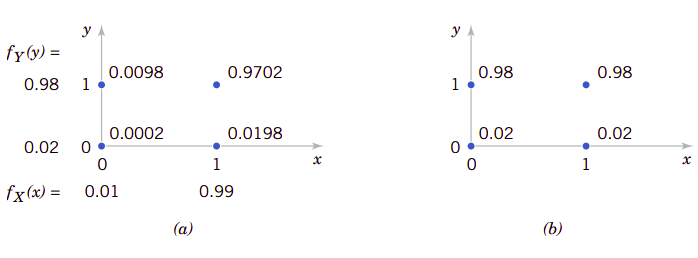
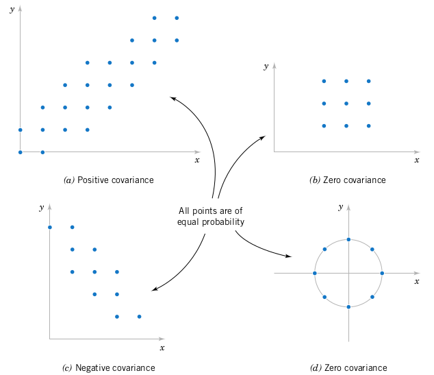

# 5、联合概率分布

在第3章和第四章研究的概率分布都是指间一随机变量的分布。但是有时为了描述一个事物，可能需要两个以上的随机变量，比如空气质量的问题。要描述空气质量，必须要描述它的颗粒物质(比如PM10)和臭氧的含量。这两个指标会同时受到几个因素的不同影响，因此，它们的分布是比此相关的，比如如果测得PM10上升，则臭氧浓度也可能上升，因此需要研究它们的共同概率。另外一个例子就是混凝土的立方抗压强度与耐久性两大类性能的相互影响。中国高速铁路混凝土的耐久性要求有多个指标，比如反映氯离子渗透的混凝土电通量指标。混凝土的抗压强度和电通量的测量值同样是随机变量。高速铁路混凝土往往对电通量的上限有一定的限制。但是，水胶比、减水剂用量、矿物外掺数的用量、砂率等等因素都对混凝土的也结构有重大影响，水胶比还直接影响混凝土立方抗压强度，并且是主要影响因素。当水胶比降低时，混凝土的立方抗压强度会提高，同时混凝土的电通量会降低。种种因素都要求我们去研究在共同因素的作用下，两个随机变量的概率分布的性质。这是本章要解决的问题。

!!!note "学习目标"
    经过认真学习本章内容，可以做到：

    1. 使用联合概率质量函数和联合概率密度函数计算概率
    2. 从联合概率分布计算边缘概率和条件概率
    3. 解释和计算随机变量之间的协方差和相关系数
    4. 使用多项式分布确定概率
    5. 理解二元正态分布的性质
    6. 计算随机变量线性组合的平均值和方差并计算正态分布随机变量线性组合的概率
    7. 确定随机变量一般函数的分布

## 5.1、两个或多个随机变量

在[第3章](third.md)和[第四章](fourth.md)我们研究了单一随机变量的概率分布。但是在随机实验中往往需要定义多个随机变量。比如空气质量的研究中，往往至少需要定义它的PM10和臭氧浓度。我们生产的混凝土原材料也需要两个以上的指标，比如水泥。我们关心水泥的早期强度，也关心它的需水量(用标准稠度用水量量化）。水泥的需要量指标标准稠度用水量都与水泥的早期强度都受水泥细度的影响。因此，当我们测量早期强度增高时，有可能它的标准稠度用水量也会增高。

这样的实例有很多。在高速铁中大建设时期，要求它的混凝土是高性能混凝土，混凝土结构使用寿命需要100年。为此要限定混凝土的某些耐久性指标，比如反映氯离子渗透性能的电通量。如果我们用随机变量$X$表示混凝土的立方抗压强度，用$Y$表示它的电通量指标。由于减水剂用量、矿物外掺料的品种及用量都会改变混凝土内部毛细孔的孔径分布，因此为改变电通量的大小。特别是矿物外掺的作用可以持续相当相当长的一个日期(比如50年)，它即会不断地改进毛细孔的结构，也会改进混凝土的立方抗压强度，这种因素会同时影响两个随机变量。同样的，水胶比也能影响早期的混凝土强度，影响毛细孔的总体积率，这也会对抗压强度和电通量产生影响。这些影响究竟如何呢？需要我们去研究$X$和$Y$的概率。比如，如果$X$的范围在$[30, 70]$MPa，$Y$的范围在$[300, 2800]$库伦。我们可会关心$P(30<X<70\text{和}300<Y<2800)$。

因为我们对一批生产的混凝土同时取样制作立方抗压强度试件和电通量用试件，因此材料和配合比是相同的，材料和生产过程的波动会同时影响这两种试件的抗压强度和电通量测量值。所以，我们希望抗压强度要高，同时还希望电通量要小。

一般地，如果$X$和$Y$是两个随机变量，定义它们的共同行为的概率分布就称为**联合概率分布**。这是本章要研究的主要内容。
### 5.1.1、联合概率分布

为了简化，我们从两个随机变量的随机实验开始研究联合分布，然后再推广到多于两个随机变量的联合概率分布。

如果$X$和$Y$是离散随机变量，那么它们的联合概率分布可以用在范围$(X, Y)$内所有的点$(x,y)$及所对应的概率来描述。有时我们又称两个随机变量的联合概率分布为**双变量概率分布**或**双变量分布**。也可以使用联合分布质量函数来描述两个离散随机变量的联合分布。同时为了简化，我们把概率$P(X=x\text{和}Y=y)$简写为$P(X=x,Y=y)$。

!!!note "联合概率质量函数"
    随机变量$X$和$Y$的**联合概率质量函数**$f_{xy}(x,y)$需要满足：

    $$
    \begin{align}
    (1)&\qquad f_{xy}(xy)\leq 0\nonumber\\
    (2)&\qquad \sum_{x}\sum_{y}f_{xy}(x,y)=1\nonumber\\
    (3)&\qquad f_{xy}(x,y)=P(X=x,Y=y)\qquad
    \end{align}
    $$

对于单一随机变量的质量分布我们假定在它的取值范围之外的概率都为零，对于多元随机变量也一样，在所有随机变量的取值范围之外的概率也为零。这是概率质量函数的特点。

两个以上的连续随机变量组成一个二维的连续空间。在这个空间上它的**联合概率分布密度函数**，通过密度函数即可以求得任意区域$R$上的概率。联合概率密度函数在任意区域$R$上的二元积分即是这两个连续随机变量在$R$上的概率。这个概率还可以解释为概率分布密度曲面在$R$上围成的体积。

!!!note "联合概率密度函数"
    用$f_{XY}(x,y)$表示连续随机变量$X$和$Y$的**联合概率密度函数**，它应该满足：

    $$
    \begin{align}
    (1)&\qquad \text{对于所有x,y}\qquad f_{XY}(x,y)\geq 0 \nonumber\\
    (2)&\qquad \int\limits_{-\infty}^{\infty}\int\limits_{-\infty}^{\infty}f_{XY}(x,y)dxdy=1\nonumber\\
    (3)&\qquad\text{对于二维空间上的任意区域R：}\nonumber\\
    &\qquad\qquad P((X,Y)\in R)=\int\limits_{R}\int f_{XY}(x,y)dxdy\qquad\qquad\qquad
    \end{align}
    $$

### 5.1.2、边缘概率分布

在随机实验中如果定义了两个及两个以上的随机变量，一个非常重要的问题就是区分$X$和$Y$的联合分布和各个变量的单独分布。随机变量的单独概率分布指的是它的**边缘概率分布**。

一般地，随机变量$X$的边缘概率分布可以由$X$与其它变量的联合概率分布求得。比如，设想随机变量$X$和$Y$，为了确定$P(X=x)$的概率，只需要固定$X=x$加总所有的$P(X=x,Y=y)$的概率。即：

$$
P(X=x)=\sum\limits_{y}P(X=x,Y=y)
$$

!!!note "实例5.1"
    下表为连续随机变量$X$和$Y$的联合概率质量函数。试求$P(X=3)$的值。
    
    
    $$
    \begin{align}
    P(x=3)=f_{X}(3)&=P(X=3,Y=1)+P(X=3,Y=2)\nonumber\\
    &\qquad+P(X=3,Y=3)+P(X=3,Y=4)\nonumber\\
    &=0.25+0.2+0.05+0.05=0.55\nonumber
    \end{align}
    $$

从实例5.1中的概率质量函数表，可以分别加上$X$取某一值的列的所有概率质量函数值求得$X$取该值的概率，并写在表格的边缘。同样地，分别加上$Y$取某一值的行的所有概率质量函数值可以求得$Y$取该值的概率，也写在表格的边缘。正是因为这些概率写在表格的连续，所以早期就被称为为边缘概率。

对于连续随机变量，仍然是求和的概念，只是要用积分求和，所以有：

!!!note "边缘概率密度函数"
    连续随机变量$X$和$Y$的联合概率密度函数为$f_{XY}(x,y)$，则$X$和$Y$的**边缘概率密度函数**分别为：

    $$
    \begin{equation}
    f_{X}(x)=\int\limits_{y} f_{XY}(x,y)dy\qquad\text{和}\qquad f_{Y}=\int\limits_{x}f_{XY}(x,y)dx\qquad
    \end{equation}
    $$

    其中，第一个积分是针对$X=x$时所有$(X,Y)$的积分，第二个积分是针对$Y=y$时对所有$(X,Y)$的积分。

### 5.1.3、条件概率分布

两个随机变量的联合概率分布在本质上指的是在它们的取值空间中同时满足某一个条件的概率，其概率的完整地书写为$P(X=x and Y=y)$，在逻辑上两者是“与”的关系。而条件概率又有不同，它是指在某一个条件成立的前提下，随机变量取某一个值时的概率。考虑两个随机变量，则它应该是$P(X=x|Y=y)$。

还记得事件$A$和$B$的条件概率$P(B|A)=P(A\cap B)/P(A)$。将它应用到两个随机变量上，只需要将$X=x$和$Y=y$定义为对应事件$A$和$B$即可。

!!!note "实例5.2"
    仍然以实例5.1的数据为例。我们要求$P(Y=1|X=3)$的概率。我们定义事件$X=3$为事件$A$，$Y=1$为事件$B$。则有：

    $$
    \begin{align}
    P(Y=1|X=3)&=P(X=3,Y=1)/P(X=3)\nonumber\\
    &=f_{XY}(3,1)/f_{X}(3)=0.25/0.55=0.454\nonumber
    \end{align}
    $$

    同理可以得到：

    $$
    \begin{align}
    P(Y=2|X=3)&=P(X=3,Y=2)/P(X=3)\nonumber\\
    &=f_{XY}(3,2)/f_{X}(3)=0.2/0.55=0.364\nonumber
    \end{align}
    $$

    还可以求得$P(Y=3|X=3)=0.091$以及$P(Y=4|X=3)=0.091$。还需要注意，$P(Y=1|X=3)+P(Y=2|X=3)+P(Y=3|X=3)P(Y=4|X=3)=1$。这四个概率定义了在给定$X=3$时的$Y$的概率分布。

因此，我们可以认为在给定$X=x$的前提下定义的$Y$的条件概率是一个新的概率分布。

!!!note "条件概率密度函数"
    设连续随机变量$X$和$Y$，它的联合概率密度函数为$f_{XY}(x,y)$，则在给定$X=x$的前提下$Y$的**条件概率密度函数**为：

    $$
    \begin{equation}
    \text{对于}f_{X}(x)>0\qquad f_{Y|x}(y)=\frac{f_{XY}(x,y)}{f_{X}(x)}\qquad\qquad
    \end{equation}
    $$

条件概率密度函数提供了在给定$X=x$条件下$Y$的条件概率。

!!!note ""
    因为条件概率密度函数$f_{Y|x}(y)$是在$R_x$上所有$y$的概率密度函数，所以它满足以下关系：

    $$
    \begin{align}
    (1)&\qquad f_{Y|x}(y)\geq 0\nonumber\\
    (2)&\qquad \int f_{Y|x}(y)dy=1\nonumber\\
    (3)&\qquad \text{对于在Y的定义域内的任意集合B}\qquad P(Y\in B|X=x)=\int\limits_{B}f_{Y|x}(y)dy\qquad
    \end{align}
    $$

我们要记住的就是，两个随机变量定义的条件概率是一种条件分布，因此它同样有平均值和方差。其定义如下：

!!!note "条件平均值和方差"
    在给定$X=x$条件下的**条件平均值**为$E(Y|x)$或$\mu_{Y|x}$，我们有：

    $$
    \begin{equation}
    E(Y|x)=\int\limits_{Y}yf_{Y|x}(y)dy\qquad
    \end{equation}
    $$

    在给定$X=x$的条件下$Y$的条件方差为$V(Y|x)$或$\sigma^2_{Y|x}$，我们有：

    $$
    V(Y|x)=\int\limits_{y}(y-\mu_{Y|x})^2f_{Y|x}(y)dy=\int\limits_{y}y^2f_{Y|x}(y)dy-{\mu^2_{Y|x}}\qquad
    $$

### 5.1.4、独立性

在某些随机实验中，随机变量$X$的值并不会影响与之相关的随机变量$Y$的取值概率。比如，在我们制作的混凝土立方抗压强度试件中，一个试件的边长与该试件所测定的强度值可以定义为两个变量，即随机变量$X$表示试件的边长，随机变量$Y$表示其测得的强度。如果我们规定边长随机变量$X$有两个值，一个是合格，一个是不合格，分别用0和1表示；同时又规定强度随机变量$Y$也有两个值，一个是合格，一个是不合格，分别用0和1表示。即：

$$
X=\begin{cases}1&\qquad\text{如果长度满足要求}\\0&\qquad\text{不满足要求}\end{cases}
$$

$$
Y=\begin{cases}1&\qquad\text{如果强度满足要求}\\0&\qquad\text{不满足要求}\end{cases}
$$

假定随机变量$X$和$Y$的联合概率分布为$f_{XY}(x,y)$，如图5.1(a)所示，其边缘概率分布可见图5.1(a)。请注意$f_{XY}(x,y)$=f_{X}(x)f_{Y}(y)$成立。它们的条件概率质量函数$f_{Y|x}(y)$可见图5.1(b)。同样请注意，对于任意$x$$f_{Y|x}(y)=f_{Y}(y)$也成立。这表明，无论混凝土试件的边长是否满足要求，都不会影响混凝土强度是否满足要求。

!!!note "图5.1、随机变量$X$和$Y$的联合分布与条件概率分布"
    

同样地，如果把随机变量取某一个值视为一个随机事件，那么可以利用独立事件概率的关系，即无论何时，只要对于所有$(x,y)$，$f_{XY}(x,y)=f_{X}(x)f_{Y}(y)$成立，那么随机事件$X$和$Y$就是**独立**的随机变量。同时，也要注意到，只要两个随机变量是独立的，则对于所有$(x,y)$，$f_{XY}(x,y)=f_{X}(x)f_{Y}(y)$也成立。这个条件是充分必要条件。只要有一个$(x,y)$的组合导致$f_{XY}(x,y)=f_{X}(x)f_{Y}(y)$不成立，那么两个随机变量也不是独立的。如果两个随机变量$X$和$Y$是独立的，那么对于$f_{X}(x)>0$，我们可以得到：

$$
f_{Y|x}(y)=\frac{f_{XY}(x,y)}{f_{X}(x)}=\frac{f_{X}(x)f_{Y}(y)}{f_{X}(x)}=f_{Y}(y)
$$

由此我们可以得到两个随机变量独立的定义：

!!!note "随机变量的独立性"
    对于随机变量$X$和$Y$，只要下述条件任意一个为真，则其它条件也会为真，此时$X$和$Y$是**独立的**：

    $$
    \begin{align}
    &(1)\qquad f_{XY}(x,y)=f_{X}(x)f(y)_{Y}\nonumber\\
    &(2)\qquad f_{Y|x}(y)=f_{Y}(y)\qquad \forall x,y\space\space\text{with}\space\space f_{X}(x)>0\nonumber\\
    &(3)\qquad f_{X|y}(x)=f_{X}(x)\qquad \forall x,y\space\space\text{with}\space\space f_{Y}(y)>0\nonumber\\
    &(4)\qquad \text{对于}X\text{和}Y\text{的取值范围内的任意集合}A\text{和}B\text{存在}\qquad P(X\in A, Y\in B)=P(X\in A)P(Y\in B)\qquad
    \end{align}
    $$

如果已开发出了我们的研究系统的概率模型，那么可以从随机变量分布的性质就可以确定是否彼此独立。如果我们对所研究系统有充分的研究和认识，也可以假定随机变量是独立的。在假定独立的基础上，从边缘概率分布可以计算出两个随机变量的概率。比如在某一计算机控制系统中，计算机制搜索时间与成人的高度这两个随机变量就是彼此独立的。

### 5.1.5、多于两个随机变量

在一个随机实验过程中，可以定义两个随机变量，当然也能定义多个随机变量。多个随机变量也会有联合概率分布。

假定有随机变量$X_1,X_2,X_3,\cdots,X_p$，只要有计算在$p$维空间中的某一区域$R$的$X_1,X_2,X_3,\cdots,X_p$概率的方法，则可以确定$X_1,X_2,X_3,\cdots,X_p$的概率分布。设$f_{X_1,X_2,X_3,\cdots,X_p}(x_1,x_2,x_3,\cdots,x_P)$为$X_1,X_2,X_3,\cdots,X_p$的联合概率密度函数，则可以用在区域$R$上对$f_{X_1,X_2,X_3,\cdots,X_p}(x_1,x_2,x_3,\cdots,x_P)$的多重积分计算$X_1,X_2,X_3,\cdots,X_p$在区域$R$上的概率。

!!!note "联合概率密度函数"
    对于连续随机变量$X_1,X_2,X_3,\cdots,X_p$，我们用$f_{X_1,X_2,X_3,\cdots,X_p}$表示它的**联合概率密度函数**，则此函数应该满足以下条件：

    $$
    \begin{align}
    &(1)\qquad f_{X_1,X_2,X_3,\cdots,X_p}(x_1,x_2,\cdots,x_p)\geq 0\nonumber\\
    &(2)\qquad \int\limits_{-\infty}^{\infty}\int\limits_{-\infty}^{\infty}\cdots\int\limits_{-\infty}^{\infty}f_{X_1X_2\cdots X_p}(x_1, x_2,\cdots x_p)dx_1dx_2\cdots dx_p=1\nonumber\\
    &(3)\qquad\text{对于p维空间的任意区域R，}\nonumber\\
    &P[(X_1,X_2,\cdots,X_p)\in B]=\int\int\limits_{B}\int f_{X_1,X_2,\cdots,X_P}(x_1,x_2,\cdots,x_p)dx_1dx_2\cdots dx_p\qquad
    \end{align}
    $$

多个随机变量的边缘分布也是我们要关心的概率分布，它的定义可以从两个随机变量的边缘分布推广而得，对于连续性随机变量组，如果知道它们的联合概率密度函数，那么可以计算连续随机变量组的边缘分布：

!!!note "边缘概率密度函数"
    如果连续随机变量$X_1,X_2,\cdots,X_p$的概率密度函数为$f_{X_1X_2X_p}(x_1,x_2,\cdots,x_p)$，则$X$的**边缘概率密度函数**为：

    $$
    \begin{equation}
    f_{X_i}(x_i)=\int\int\cdots\int f_{X_1X_2\cdots X_p}(x_1,x_2,\cdots,x_p)dx_1dx_2\cdots dx_{i-1}dx_{i+1}\cdots dx_p \qquad
    \end{equation}
    $$

    其中积分区间是在$X_i=x_i$条件下所有$X_1,X_2,\cdots,X_p$的所有点组成的区域。

同样，我们可以有多个连续随机变量联合概率分布的平均值和方差的计算方法：

!!!note "联合分布的平均值和方差"
    
    $$
    \begin{align}
    &\qquad E(X_i)=\int\limits_{-\infty}^{\infty}\int\limits_{-\infty}^{\infty}\cdots\int\limits_{-\infty}^{\infty}x_if_{X_1X_2\cdots X_p}(x_1,x_2,\cdots,x_p)dx_1dx_2\cdots dx_p\nonumber\\
    &\text{和}\\
    &\qquad V(X_i)=\int\limits_{-\infty}^{\infty}\int\limits_{-\infty}^{\infty}\cdots\int\limits_{-\infty}^{\infty}(x_i-\mu _{X_i})^2f_{X_1X_2\cdots X_p}(x_1,x_2,\cdots,x_p)dx_1dx_2\cdots dx_p\nonumber
    \end{align}
    $$

一组随机变量之间也有独立性存在，其定义为：

!!!note "独立性"
    设有一组随机变量$X_1, X_2, \cdots,X_p$，对于所有的$x_1,x_2,\cdots,x_p$，当且仅当下式存立：

    $$
    \begin{equation}
    f_{X_1X_2\cdots X_p}(x_1, x_2, \cdots, x_p)=f_{X_1}(x_1)f_{X_2}(X_2)\cdots f_{X_p}(x_p)
    \end{equation}
    $$

    则这组随机变量之间是相互独立的。

有必要注意的是，公式(11)是一组随机变量之间相互独立的充分必要条件。

针对相互独立的一组随机变量$X_1, x_2,\cdots,X_p$和任意的区域$A_1, A_2, \cdots, A_p$可以推导得到:

$$
P(X_1\in A_1, X_2\in A_2,\cdots, X_p\in A_p)=P(X_1\in A_1)P(X_2\in A_2)\cdots P(X_p\in A_p)
$$

## 5.2、协方差和相关性

我们十分关心两个或多个随机变量的共同变化情况。比如，高速铁路所定义的高性能混凝土的电通量和强度都同时受到混凝土的水胶比、矿物外掺料种类和数量等等的影响。但它们在混凝土的不同龄期在这些因素的影响下究竟是如何共同变化的呢。在充分收集数据的情况下，需要我们用协方差和相关系数来描述它们。

**协方差**是测量两个随机变量之间关系。为了定义协方差，必须首先描述两个随机变量函数$h(X,Y)$的期望值。此定义只需要简单地扩展了单变量函数的期望值定义。

!!!note "两个随机变量的期望值"
    $$
    \begin{align}
    E[h(X,Y)]=\begin{cases}
        \sum\sum h(x,y)f_{XY}(x,y) \qquad  X,Y\text{是离散变量}\\
        \\
        \int\int h(x,y)f_{XY}(x,y)dxdy \qquad X,Y\text{是连续变量}
        \end{cases}
    \end{align}
    $$

同样地，我们仍然能认为$E[h(X,y)]$是函数所有取值的加权平均值，其权为相应点或区域的概率或概率密度。期望值表达了在一个长的重复随机实验的序列中会期望能出现的平均值。

在定义了两个随机变量函数的期望值的基础上，我们可以定义两个随机变量之间的协方差。

!!!note "协方差"
    两个随机变量$X$和$Y$的**协方差**$cov(X,Y)$或$\sigma_{XY}$定义为：

    $$
    \begin{equation}
    \sigma_{XY}=E[(X-\mu_X)(Y-\mu_y)]=E(XY)-\mu_X\mu_Y\qquad
    \end{equation}
    $$

我们用图5.2来充分解释协方差的意义。如果$X$和$Y$的联合分布的概率为正，并且随着$X$和$Y$之间的沿正(或负)斜率的直线变化时，$\sigma_{XY}$为正(或负)。如果$X$和$Y$的变化沿着正斜率变化，并且当$Y-\mu_{Y}>0$时，有$X-\mu_{X}>0$，这时它们的积$(x-\mu_{X})(y-\mu_{Y})$。但是如果沿着负斜率的方向变化，则当$$Y-\mu_{Y}<0$时，有$X-\mu_{X}>0$；反之，当$$Y-\mu_{Y}>0$时，有$X-\mu_{X}<0$。从这个意义上来看，协方差描述了两个随机变量之间的变动趋势。图5.2来介绍了协方差为零的两个实例。

!!!note "图5.2、联合函数分布及协方差的符号"
    

协方差还能测量两个随机变量之间的**线性关系**。如果两个随机变量之间的关系更趋向于非线性，则协方差对关系更不敏感。如图5.2(d)所示。非零概率的点都在一个圆上。这时变量之间的关系是可识别的，但是它们的协方差仍然为零。

可以推导得到：

$$
E[(X-\mu_{X})(Y-\mu_{Y})]=E(XY)-\mu_{X}\mu_{Y}
$$

表达随机变量之间关系的另外一个测量就是相关系数，它的意义比协方差更直白。

!!!note "相关系数"
    两个随机变量$X$和$Y$的**相关系数**为$\rho$，它的定义如下：

    $$
    \begin{equation}
    \rho_{XY}=\frac{cov(X,Y)}{\sqrt{V(X)V(Y)}}=\frac{\sigma_{XY}}{\sigma_{X}\sigma_{Y}}\qquad
    \end{equation}
    $$

因为两个随机变量的方差总是大于零的，因此如果$X$和$Y$的协方差为正、负或零，就决定了相关系数为正、负或零。我们可以得到以下结论：

!!!note "重要结论"
    对于两个随机变量$X$和$Y$，存在：
    
    $$
    \begin{equation}
    -1\leq\rho_{XY}\leq +1\qquad
    \end{equation}
    $$

相关系数只是用每一个随机变量的标准差去缩放协方差，最终得到一个无量纲的数量，并且也消除了数据大小之间的影响，因此可以用于比较不同单位、不同数量级数据对之间的线性关系。

如果$X$和$Y$的变化沿着正(或负)斜率的直线向下，则$\rho_{XY}$接近$+1$(或$-1$)。如果$\rho$等于$+1$(或$-1$)，则联合概率分布会沿直线下落。两个随机变量的相关系数非零，则它们是**相关的**。类似于协方差，相关系数是两个随机变量之间的线性测量参数。

如果两个随机变量是独立的，则不能期望它们之间在联合概率分布上存在任何关系。下面的结果是成立的。

!!!note "独立随机变量的协方差和相关系数"
    如果$X$和$Y$是独立的两个随机变量，则有：

    $$
    \begin{equation}
    \sigma_{XY}=\rho_{XY}=0\qquad
    \end{equation}
    $$

## 5.3、常见的联合分布

### 5.2.1、多项式概率分布

多个离散随机变量的联合分布是对二项式分布的扩展。生成概率分布的随机实验由一系列的独立判决实验组成。但是每一个判决实验有多个结果而非两个结果。这一联合分布在现实工程与科学研究中都十分有用，所以我们把它介绍给大家。

!!!note "多项式分布"
    假定随机实验由一系列$n$个判决实验组成。假定：

    (1). 每一个判决实验的结果都是$class1，class2，\cdots, classk$共计$k$个结果中的一个。

    (2). 每一个判决实验生成$k$个结果的的概率是相同的，分别为$p_1,p_2,\cdots, p_k$。

    (3). 判决实验是独立的。

    随机变量$X_1, X_2,\cdots, X_k$分别表示判决结果为$classk$的数量，则它们的分布就是**多项式分布**，并且其联合概率质量函数为：

    $$
    \begin{align}
    &P(X_1=x_1,X_2=x_2,\cdots,X_k=x_k)=\frac{n!}{x_1!x_2!\cdots x_k!}p_1^{x_1}p_2^{x_2}\cdots p_k^{x_k}\qquad\\
    &\text{for}\qquad x_1+x_2+\cdots+x_k=n\qquad \text{and}\qquad p_1+p_2+\cdots + p_k=1\nonumber
    \end{align}
    $$

多项式分布可以认为是二项式分布的多变量扩展。在多项式随机实验中的每一次判决实验都可以认为它生成或不生成某一class$i i=1,2,\cdots,k$。因为随机变量$X_i$是判决结果为class$i$的数量，所以，$X_i$是二项式分布。

!!!note "多项式分布的平均值和方差"
    如果$X_1,X_2,\cdots,X_k$是多项式分布，那么$X_i$的边缘概率分布二项式分布，其平均值和方差分别为：

    $$
    \begin{equation}
    E(X_i)=np_i\qquad \text{and}\qquad V(X_i)=np_i(1-p_i)\qquad
    \end{equation}
    $$

### 5.3.2、二元正态分布

一个随机变量的正态分布可以扩展到两个随机变量的联合分布，这种扩展是一种十分重要的二元概率分布。

!!!note "实例5.3"
    我们在本章多次提到高速铁路定义的高性能混凝土的两个指标，一个是强度，一个是电通量，它们都受到混凝土配合比中水胶比、矿物外掺料种类及掺量、混凝土的龄期等等因素的共同影响，因此它们并不是独立的随机变量。假定$X$表示高速铁路的高性能强度，而$Y$表示高速铁路高性能混凝土的电通量，它们的范围分别在$[30,70]$MPa和$[200,2800]$库伦，我们也许会关心$P(30\leq X\leq 70, 200\leq Y\leq 2800)$的值。

!!!note "二元正态概率密度函数"
    **二元正态分布**的概率密度函数为：

    $$
    \begin{align}
    f_{XY}(x,y;\sigma_X,\sigma_Y, \mu_X, \mu_Y,\rho)&=\frac{1}{2\pi\sigma_{X}\sigma_{Y}\sqrt{1-\rho^2}}\text{exp}\left\{\frac{-1}{2(1-\rho^2)}\left[\frac{(x-\mu_X)^2}{\sigma_X^2}\right.\right.\nonumber\\
    &\qquad \left.\left. {} -\frac{2\rho(x-\mu_X)(y-\mu_Y)}{\sigma_X\sigma_Y}+\frac{(y-\mu_Y)^2}{\sigma_Y^2}\right]\right\}\qquad\\  
    \end{align}    
    $$

    其中$-\infty<x<\infty$以及$-\infty<y<\infty$。概率分布的参数为
    $\sigma_X>0,\sigma_Y>0$、$-\infty<\mu_X<\infty,-\infty<\mu_Y<\infty$以及 $-1<\rho<1$

同样地，我们也能用边缘分布、平均值、方差、协方差等等来简要地表达二元正态分布。

!!!note "二元正态随机变量的边缘分布"
    如果$X$和$Y$是二元正态分布的随机变量，它们的联合概率密度函数为$f_{XY}(x,y;\sigma_X^2,\sigma_Y^2,\mu_X,\mu_Y,\rho)$，则$X$和$Y$的**边缘概率分布**是正态分布，其平均值分别为$mu_X$和$\mu_Y$，标准差分别为$\sigma_X$和$\sigma_Y$。

!!!note "二元正态随机变量的条件分布"
    如果$X$和$Y$是二元正态分布，其联合概率密度函数为$f_{XY}(x,y;\sigma_X,\sigma_Y,\mu_X,\mu_Y,\rho)$，则在给定$X=x$时$Y$的条件分布是正态分布，并且它的平均值为：

    $$
    \mu_{Y|x}=\mu_Y-\mu_X\rho\frac{\sigma_Y}{\sigma_X}+\frac{\sigma_Y}{\sigma_X}\rho x
    $$

    其方差为：

    $$
    \sigma_{Y|x}^2=\sigma_{Y}^2(1-\rho^2)
    $$

需要解释的是，上面的公式中符号$\rho$代表的是$X$和$Y$之间的相关系数。它也是联合概率密度函数的一个参数。

!!!note "二元正态随机变量的相关系数"
    如果$X$和$Y$是二元正态分布，其联合概率密度函数为$f_{XY}(x,y;\sigma_X,\sigma_Y,\mu_X,\mu_Y,\rho)$，则$X$和$Y$之间的相关系数为$\rho$。

我们可以接收如下结论：如果$\rho$从0变动到0.9，那么概率会更集中到一条直线上，如果$\rho=-1$或$\rho=1$，所有的概率都会集中到直线上，这时$X$和$Y$假定不在直线上的概率为零。在这种情况下，二元正态分布概率密度没有定义。

一般地，零相关系数并不能确定两个随机变量之间是独立的。但在$X$和$Y$是二元正态分布这一特定的情况下，如果$\rho=0$，则它们是独立的。

!!!note "零相关系数的二元正态随机变量是相互独立的随机变量"
    如果$X$和$Y$是二元正态分布，且$\rho=0$，则$X$和$Y$是独立的随机变量。

## 5.4、随机变量的线性函数

有时随机变量会定义为一个或多个随机变量的函数。比如，在测试立方抗压强度的试件边长时，得到两个随机变量$X_1$和$X_2$，则试件的周长为$Y=2X_1+2X_2$，它也是一个随机变量。同样我们还可以回想负二项式分布的随机变量，它可以表达为几个几何随机变量之和。

在本章，我们要介绍随机变量线性组合的随机变量。

!!!note "线性组合"
    在给定随机变量$X_1,X_2,\cdots,X_p$以及常数$c_1,c_2,\cdots,c_p$的前提下，

    $$
    \begin{equation}
    Y=c_1X_1+c_2X_2+\cdots+c_pX_p\qquad
    \end{equation}
    $$
    
    就是$X_1,X_2,\cdots,X_p$的**线性组合**。

利用联合概率分布的平均值定义，可以得到：

!!!note "线性函数的平均值"
    如果$Y=c_1X_1+c_2X_2+\cdots+c_pXP$，则有：

    $$
    \begin{equation}
    E(Y)=c_1E(X_1)+c_2E(X_2)+\cdots+c_pE(X_p)
    \end{equation}
    $$

当然利用方差的定义，也可以得到线性函数的方差：

!!!note "线性函数的方差"
    如果$X_1,X_2,\cdots,X_p$是随机变量，并且$Y=c_1X_1+c_2X_2+\cdots+c_pX_p$，则一般地有：

    $$
    \begin{equation}
    V(Y)=c_1^2V(X_1)+c_2^2V(X_2)+\cdots+c_p^2V(X_p)+2\sum\limits_{i<j}\sum c_ic_j\text{cov}(X_i,X_j)\qquad
    \end{equation}
    $$

    如果$X_1,X_2,\cdots,X_p$是**独立的**，则有：

    $$
    \begin{equation}
    V(Y)=c_1^2V(X_1)+c_2^2V(X_2)+\cdots+c_p^2V(X_p)\qquad
    \end{equation}
    $$

需要注意的是，公式(23)成立的条件是随机变量是独立的随机变量。这一点十分重要。有一个极端的实例，即在$X_1$是随机变量的情况下，设$X_2=-X_1$。很清楚，$X_1$和$X_2$并不独立，并且它们的$\rho_{XY}=-1$。现在设$Y=X_1+X_2$，则它等于零的概率为1。$Y$的取值并不会发生变化，因此它的方差$V(Y)=0$，与$X_1$和$X_2$的方差无关，不能使用公式(23)计算。

!!!note "实例5.3"
    半导体产品由三层组成。如果第一层、第二层和第三层厚度的方差分别为25、40和30平方纳米，问最终产品的厚度方差为多少？

    设$X_1,X_2,X_3$和$X$是随机变量，分别表示层厚和最终产品的厚度。很明显，各层的厚度之间没有相关性，其对应随机变量是独立的随机变量。因此，$X$的方差由公式(23)计算得：

    $$
    \begin{align}
    V(X)&=V(X_1)+V(X_2)+V(X_3)\nonumber\\
    &=25+40+30=95\nonumber
    \end{align}
    $$

    由计算结果可知，最终产品的厚度方差为三层厚度的方差之和。表明每一层的数据变动都会传播到最终产品的厚度上来。这就是公式(23)表达的**误差传播**原理。

误差传播原理在许多工程实例中也会有体现。特别是公式(22)也同样表达了误差传播原理。比如，在混凝土的生产中，每一项材料的计量都有误差，它们都会对混凝土的立方抗压强度产生一定的影响。在生产中，各项材料的计量是相互独立的，它们的误差也会传播到混凝土的立方抗压强度上。误差传播原理与随机变量函数是否为线性函数无关。

我们常常使用多个独立的随机变量的平均值，它也是一种特殊的线性组合，它的许多性质在工程中都有广泛的应用，所以在此向读者作一简单介绍。

!!!note "平均值的平均值和方差"
    设有$X_1,X_2,\cdots,X_p$随机变量，并且对于$i=1,2,\cdots,p$都有$E(X_i)=\mu$，则对于线性组合$\overline{X}=X_1+X_2+\cdots+X_p$有：

    $$
    \begin{equation}
    E(\overline{X})=\mu\qquad
    \end{equation}
    $$

    如果$X_1,X_2,\cdots,X_p$是独立的，且对于$i=1,2,\cdots,p$都有$V(X_i)=\sigma$，则有：

    $$
    \begin{equation}
    V(\overline{X})=\frac{\sigma^2}{p}\qquad
    \end{equation}
    $$

正态随机变量的再生性质表明独立正态分布随机变量的线性组合仍然是正态变量。

!!!note "正态分布随机变量的再生性质"
    如果$X_1,X_2,\cdots,X_p$是独立的正态分布随机变量，对于$i=1,2,\cdots,p$有$E(X_i)=\mu_i$和$V(X_i)=\sigma_i^2$，则：

    $$
    Y=c_1X_1+c_2X_2+\cdots+c_pX_p$
    $$

    是正态随机变量，且有：

    $$
    E(Y)=c_1\mu_1+c_2\mu_2+\cdots+c_p\mu_p
    $$

    以及：

    $$
    \begin{equation}
    V(Y)=c_1^2\sigma_1^2+c_2^2\sigma_2^2+\cdots+c_p^2\sigma_p^2\qquad
    \end{equation}
    $$

## 5.5、随机变量的一般函数

在许多统计技术应用的领域，都需要推导一个或多个随机变量函数的概率分布。在本节，我们向读者介绍几个有用的结果，为解决这一问题，这些结果对我们有非常大的帮助。

假定$X$是离散随机变量，其概率质量函数为$f){X}(x)$。设$Y=h(X)$定义了随机变量$X$和$Y$之间的一对一变换，它是一个函数。我们希望能找到$Y$的概率分布。一对一变换指的是每一个$x$值都只与一个且仅有一个$y=h(x)$的值对应，并且每一个$y$值都只与一个且仅有一个$x$值对应，即$x=u(y)$，$u(y)$可以通过求解$y=h(x)$获得。

现在当随机变量$X$取值$u(y)$时随机变量$Y$取值为$y$。因此$Y$的概率分布就是：

$$
f_{Y}(y)=P(Y=y)=P(X=u(y))=f_{X}[u(Y)]
$$

由此我们可以得到如下结果：

!!!note "离散随机变量的通用函数"
    假定$X$是**离散**随机变量，其概率分布为$f_{X}(x)$。设$Y=h(X)$定义了随机变量$X$和$Y$之间的一对一变换，因此从公式$y=h(x)$可以求解唯一的$x$。现在假设这个解为$x=u(y)$。那么离散随机变量$Y$的概率质量函数为：

    $$
    \begin{equation}
    f_{Y}(y)=f_{X}[u(y)]\qquad
    \end{equation}
    $$

!!!note "连续随机变量的一般函数"
    假定$X$将**连续**随机变量，其概率分布为$f_{X}(x)$。函数$Y=h(X)$是随机变量$X$和$Y$之间的一对一变换，因此由公式$y=h(x)$可以唯一地求解出用$y$表示的$x$，假定它为$x=u(y)$。则$Y$的概率分布为：

    $$
    \begin{equation}
    f_{Y}(y)=f_{X}[u(y)]|J|\qquad
    \end{equation}
    $$

    其中，$J＝u'(y)$是**Jacobian**变换，在此要使用它的绝对值。

!!!note "重要概念"
    1. 联合概率密度函数(Joint probability density function)
    2. 联合概率质量函数(Joint probability mass function)
    3. 边缘概率分布(Marginal probabiltiy distribution)
    4. 条件概率密度函数(Conditional probability density function)
    5. 条件概率质量函数(Conditional probability mass function)
    6. 独立性(Independence)
    7. 条件平均值(Conditional mean)
    8. 条件方差(Conditional variance)
    9. 协方差（Covariance)
    10. 相关系数(Correlation)
    11. 多项式分布(Multinomaial distribution)
    12. 二元分布(Bivariate distribution)
    13. 二元正态分布(Bivariate normal distribution)
    14. 误差传播(Error propagation)
    15. 正态分布的再生性质(Reproductive property of the normal distribution)
    16. 随机变量的一般函数(General function of random variables) 
