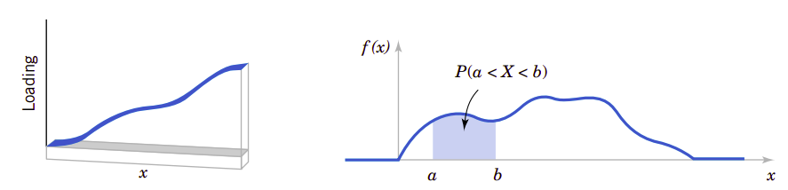
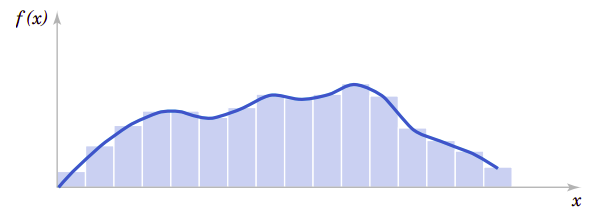

# 4、连续随机变量极其概率分布

气体动力学理论在统计和物理之间建立起了桥梁。物理学家James Maxwell设定某些假设，从而确定了气体在平衡时的分子速度的分布。分子碰撞的结果后回弹的方向是空间任意方向，这表明了等概率的概念。从这个概念出发，他假设分子碰撞后，在$x$、$y$和$z$三个方向速度是等概率的并且它们之间相互独立变化。只这一项就显示了在特定方向$x$的速度的概率分布是著名的正态连续概率分布。当然，这一基础分布还可以从其它角度探讨后(比如本章要讨论的中心极限定理)导出，但从分子运动动力学的角度讨论是最简单的。正态分布的角色例示了连续概念分布的在科学和工程领域的重要性。

!!!note "学习目标"
    经过认真学习本章内容，可以做到：
    
    1. 从概率密度函数确定概率。

    2. 从累积分布函数和确定概率以及从概率密度函数确定累积分布函数。

    3. 计算连续随机变量的平均值和方差。

    4. 理解某些常见连续随机变量分布的假设。

    5. 为特定选择适当的连续概率分布计算其概率。

    6. 计算某些常见概率分布的平均值和方差。

    7. 标准化正态随机变量。

    8. 使用标准正态分布的累积分布表计算概率。

    9. 对某些二项式分布和泊松分布计算近似概率。

## 4.1、连续随机变量

假定在混凝土拌和站针对每天同一品种混凝土测定其立方抗压强度。在实际生产中总会有小的波动影响混凝土强度，这些波动可能来源于温度的变动、试件制作的差异、生产计量的微小变动、操作者的差异、材料的波动等等等等原因，因此，即使是同一批材料、同一配合比以及同一搅拌机生产的混凝土，其立方抗压强度都会有少的变动，并不会完全一样。所以所测得的混凝土立方抗压强度表达的是一个随机变量$X$，并且用一个实数区间作为该随机变量的可能取值范围是合理的。还记得我们在[第2章](second.md)中讨论过，具有一个(无论是有限还是无限)实数区间的随机变量就是**连续随机变量**。这个模型可用于任意精度的随机变量。

因为随机变量$X$的可能值是不可数的无限多，所以$X$明显与前面所研究的离散随机变量不同。但是与离散随机变量一样的是，许多物理系统都可以使用相同或类似的连续随机变量建模。本章要会介绍这些随机变量，并提供计算概率的实例。

## 4.2、概率分布和概率密度函数

我们在力学研究领域常常用密度函数描述力的分布，也用密度描述许多其它的物理系统。比如在图4.1中，在细长梁的任意位置，其力的密度可以用密度来描述。间隔区间越大，则所受的荷载也越大。在两点$a$和$b$之间的荷载总量由区间$[a,b]$之间的积分确定。这个积分是密度函数曲线下部的面积。我们可以粗略地认为是这个区间内的荷载总值。

!!!note "图4.1、概率密度函数与力的密度函数"
    

类似地，**概率密度函数**$f(x)$可以用来描述**连续随机变量**$X$的分布。如果区间包含$X$的某个值越大，那么相应地它的$f(x$)$也会越大。$X$的概率就是曲线在$(a,b)$上的积分，也就是概率密度函数下的面积。

由此我们可以得到函数密度函数的定义：

!!!note "概率密度函数"
    对于连续随机变量$X$，它的概率**密度函数**应该满足：

    $$
    \begin{align}
    (1)&\space f(x)\geq 0 \nonumber\\
    (2)&\space \int_{-\infty}^{\infty}f(x)dx=1\nonumber\\
    (3)&\space 对于任意的a和b \qquad P(a\leq X\leq b)=\int_a^bf(x)dx=f(x)下从a到b的面积\qquad 
    \end{align}
    $$

概率密度函数为随机变量提供了简单的描述。只要$f(x)$为非负函数、$\int_{-\infty}^{\infty}f(x)dx=1$以及$P(a\leq X\leq b)\leq 1$，则满足概率的定义。在如果$x$处的事件不会发生，则概率密度函数为零；如果没有特别规定某个值的概率密度函数，也假定它为零。

可以用**柱状图**近似概率密度函数，如图4.2所示。对于每一个柱状图所对应的区间，柱的面积等于此区间测量值的相对频率(比例)。相对频率是该区间事件发生概率的近似估计。类似地，在$f(x)$下任意区间的面积等于在该区间事件发生的真实概率。

!!!note "图4.2、概率密度函数的近似柱状图"
    

最重要的一点就是$f(x)$**用于计算面积**，而这个面积表达了$X$落在$[a,b]$之间的概率。以测试混凝土立方面抗压强度为例，$X$在$[36\text{MPa}, 42\text{MPa}]$之间的概率就是$X$的概率密度函数在这个区间的积分。对于混凝土立方抗压强度来说，这是一个相对很小的区间。通过适当地选择$f(x)$的形状，我们可以表达任意随机变量的概率。$f(x)$的形状决定了$X$在$[36\text{MPa}, 42\text{MPa}]$的概率与其它相等长度区间或不同长度区间的概率的差异程度。

对于细长梁上的荷载，因为每一点都是零宽度，所以在任何点上的荷载都是零。类似地，对于连续随机变量$X$和任意值$x$来说，我们也有：

$$
P(X=x)=0
$$

从这一点来看，似乎连续随机变量的模型是无用的模型。但是，在现实世界中，当观察特定的混凝土立方抗压强度测量值时，比如，41.5MPa，这个值可以解释为是$[41.53, 41.54]$MPa经过圆整后的结果。因此，可以认为测量值41.5就是$X$落在$[41.53, 41.54]$MPa的一个值，而它在这个区间的概率并非为零。类似地，因为每一个点都是零概率的，在计算连续随机变量概率时，就不必区分$\leq$和$<$：

!!!note ""
    如果$X$是**连续随机变量**，对于任意值$x_2$和$x_2$，有：

    $$
    \begin{equation}
    P(X_1\leq X\leq x_2)=P(x_1<X\leq x_2)=P(x_1\leq X<x_2)=P(x_1<X<x_2)\qquad
    \end{equation}
    $$

## 5.3、累积分布函数

