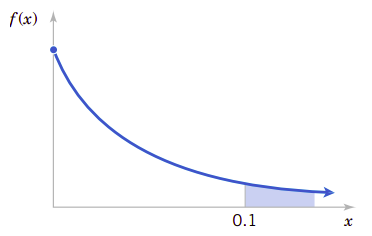

# 4、连续随机变量极其概率分布

气体动力学理论在统计和物理之间建立起了桥梁。物理学家James Maxwell设定某些假设，从而确定了气体在平衡时的分子速度的分布。分子碰撞的结果后回弹的方向是空间任意方向，这表明了等概率的概念。从这个概念出发，他假设分子碰撞后，在$x$、$y$和$z$三个方向速度是等概率的并且它们之间相互独立变化。只这一项就显示了在特定方向$x$的速度的概率分布是著名的正态连续概率分布。当然，这一基础分布还可以从其它角度探讨后(比如本章要讨论的中心极限定理)导出，但从分子运动动力学的角度讨论是最简单的。正态分布的角色例示了连续概念分布的在科学和工程领域的重要性。

!!!note "学习目标"
    经过认真学习本章内容，可以做到：
    
    1. 从概率密度函数确定概率。

    2. 从累积分布函数和确定概率以及从概率密度函数确定累积分布函数。

    3. 计算连续随机变量的平均值和方差。

    4. 理解某些常见连续随机变量分布的假设。

    5. 为特定选择适当的连续概率分布计算其概率。

    6. 计算某些常见概率分布的平均值和方差。

    7. 标准化正态随机变量。

    8. 使用标准正态分布的累积分布表计算概率。

    9. 对某些二项式分布和泊松分布计算近似概率。

## 4.1、连续随机变量

假定在混凝土拌和站针对每天同一品种混凝土测定其立方抗压强度。在实际生产中总会有小的波动影响混凝土强度，这些波动可能来源于温度的变动、试件制作的差异、生产计量的微小变动、操作者的差异、材料的波动等等等等原因，因此，即使是同一批材料、同一配合比以及同一搅拌机生产的混凝土，其立方抗压强度都会有少的变动，并不会完全一样。所以所测得的混凝土立方抗压强度表达的是一个随机变量$X$，并且用一个实数区间作为该随机变量的可能取值范围是合理的。还记得我们在[第2章](second.md)中讨论过，具有一个(无论是有限还是无限)实数区间的随机变量就是**连续随机变量**。这个模型可用于任意精度的随机变量。

因为随机变量$X$的可能值是不可数的无限多，所以$X$明显与前面所研究的离散随机变量不同。但是与离散随机变量一样的是，许多物理系统都可以使用相同或类似的连续随机变量建模。本章要会介绍这些随机变量，并提供计算概率的实例。

## 4.2、概率分布和概率密度函数

我们在力学研究领域常常用密度函数描述力的分布，也用密度描述许多其它的物理系统。比如在图4.1中，在细长梁的任意位置，其力的密度可以用密度来描述。间隔区间越大，则所受的荷载也越大。在两点$a$和$b$之间的荷载总量由区间$[a,b]$之间的积分确定。这个积分是密度函数曲线下部的面积。我们可以粗略地认为是这个区间内的荷载总值。

!!!note "图4.1、概率密度函数与力的密度函数"
    

类似地，**概率密度函数**$f(x)$可以用来描述**连续随机变量**$X$的分布。如果区间包含$X$的某个值越大，那么相应地它的$f(x$)$也会越大。$X$的概率就是曲线在$(a,b)$上的积分，也就是概率密度函数下的面积。

由此我们可以得到函数密度函数的定义：

!!!note "概率密度函数"
    对于连续随机变量$X$，它的概率**密度函数**应该满足：

    $$
    \begin{align}
    (1)&\space f(x)\geq 0 \nonumber\\
    (2)&\space \int_{-\infty}^{\infty}f(x)dx=1\nonumber\\
    (3)&\space \text{对于任意的a和b} \qquad P(a\leq X\leq b)=\int_a^bf(x)dx=f(x)下从a到b的面积\qquad 
    \end{align}
    $$

概率密度函数为随机变量提供了简单的描述。只要$f(x)$为非负函数、$\int_{-\infty}^{\infty}f(x)dx=1$以及$P(a\leq X\leq b)\leq 1$，则满足概率的定义。在如果$x$处的事件不会发生，则概率密度函数为零；如果没有特别规定某个值的概率密度函数，也假定它为零。

可以用**柱状图**近似概率密度函数，如图4.2所示。对于每一个柱状图所对应的区间，柱的面积等于此区间测量值的相对频率(比例)。相对频率是该区间事件发生概率的近似估计。类似地，在$f(x)$下任意区间的面积等于在该区间事件发生的真实概率。

!!!note "图4.2、概率密度函数的近似柱状图"
    

最重要的一点就是$f(x)$**用于计算面积**，而这个面积表达了$X$落在$[a,b]$之间的概率。以测试混凝土立方面抗压强度为例，$X$在$[36\text{MPa}, 42\text{MPa}]$之间的概率就是$X$的概率密度函数在这个区间的积分。对于混凝土立方抗压强度来说，这是一个相对很小的区间。通过适当地选择$f(x)$的形状，我们可以表达任意随机变量的概率。$f(x)$的形状决定了$X$在$[36\text{MPa}, 42\text{MPa}]$的概率与其它相等长度区间或不同长度区间的概率的差异程度。

对于细长梁上的荷载，因为每一点都是零宽度，所以在任何点上的荷载都是零。类似地，对于连续随机变量$X$和任意值$x$来说，我们也有：

$$
P(X=x)=0
$$

从这一点来看，似乎连续随机变量的模型是无用的模型。但是，在现实世界中，当观察特定的混凝土立方抗压强度测量值时，比如，41.5MPa，这个值可以解释为是$[41.53, 41.54]$MPa经过圆整后的结果。因此，可以认为测量值41.5就是$X$落在$[41.53, 41.54]$MPa的一个值，而它在这个区间的概率并非为零。类似地，因为每一个点都是零概率的，在计算连续随机变量概率时，就不必区分$\leq$和$<$：

!!!note ""
    如果$X$是**连续随机变量**，对于任意值$x_2$和$x_2$，有：

    $$
    \begin{equation}
    P(X_1\leq X\leq x_2)=P(x_1<X\leq x_2)=P(x_1\leq X<x_2)=P(x_1<X<x_2)\qquad
    \end{equation}
    $$

## 5.3、累积分布函数

与离散随机变量类似，我们也可以用累积分布函数来描述连续随机变量的分布。

!!!note "累积分布函数"
    连续随机变量$X$的**累积分布函数**为：

    $$
    \begin{align}
    F(x)=P(X\leq x)=\int_{-\infty}^{x}f(u)du \qquad
    \text{其中} -\infty<x<\infty\qquad
    \end{align}
    $$

我们知道，$P(X\leq x)=1-P(x\geq x)$。所以我们可以用累积分布密度函数来定义混凝土立方抗压强度的强度等级。比如，C35强度等级即混凝土的立方抗压强度$X$的概率$P(x\geq 35)=95%$。假期立方抗压强度的概率密度函数为$f(x)$，则强度等级为C35的混凝土立方抗压强度的概率应该为：

$$
P(X\geq 35)=1-P(35\leq X)=1-\int_{-\infty}^{35}f(u)du＝1－0.05＝0.95
$$

只要我们知道了混凝土的概率密度函数，可以轻易地计算出它的累积分布，从而也能清晰地定义混凝土的立方抗压强度的强度等级。混凝土的概率密度函数是正态分布。正态分布也是许多许多物理系统和过程的概率分布，它是如此重要，以致我们必须在本章接下来的内容要重点研究这个分布。

## 4.4、连续随机变量的平均值和方差

与离散随机变量一样，我们也可以定义它的平均值和方差，只是要用积分取代求和。考虑到积分的本质也是求和，所以平均值和方差的定义的本质是相同的。同样地，如果像图4.1那样把概率密度函数视为荷载密度，则概率密度对应了细长梁上荷载的平衡点。

!!!note "平均值和方差"
    假定$X$是连续随机变量，其概率密度函数为$f(x)$，它的**平均值**或**期望值**用$\mu$或$E(X)$表示，它们应该是：

    $$
    \begin{equation}
    \mu=E(X)=\int_{-\infty}^{\infty}xf(x)dx \qquad
    \end{equation}
    $$

    它的方差为$V(X)$或$\sigma^2$，它应该是：

    $$
    \sigma^2=V(X)=\int_{-\infty}^{\infty}(x-\mu)^2f(x)dx=\int_{-\infty}^{\infty}x^2f(x)dx-\mu^2
    $$

    $X$的**标准差**为$\sigma=\sqrt{\sigma^2}$

!!!note "连续随机变量函数的期望值"
    如果连续随机变量的概率密度函数为$f(x)$，那么：

    $$
    \begin{equation}
    E[h(X)]=\int_{-\infty}^{\infty}h(x)f(x)dx\qquad
    \end{equation}
    $$

## 4.5、常见的连续随机变量分布

与离散随机变量分布一样，人们也对各种各样的连续随机变量分布做了详细研究，我们在这里介绍几个最常用的分布。

### 4.5.1、均匀分布

连续随机变量也有均匀分布。它的概率密度函数在整个分布区间内是一个常数。

!!!note "连续均匀分布"
    如果$X$为密度函数应为：

    $$
    \begin{equation}
    f(x)=1/(b-a)\qquad a\leq x\leq b\qquad
    \end{equation}
    $$

    则$X$就是**连续均匀分布随机变量**

按照连续随机变量的平均值和方差定义，利用积分原理可以确定连续均匀分布的平均值和方差。

!!!note "平均值和方差"
    如果$X$是在区间$[a, b]$上的连续均匀分布随机变量，那么它的平均值为和方差为：

    $$
    \begin{equation}
    \mu=E(X)=\frac{a+b}{2}\qquad\text{和}\qquad\sigma^2=V(X)=\frac{(b-a)^2}{12}\qquad
    \end{equation}
    $$

根据累积分布函数的定义，可以得到在$[a, b]$上的均匀分布连续随机变量$X$，在$x$处的累积分布函数为：

$$
F(x)=\begin{cases}
0&\qquad x<a \\
(x-a)/(b-a)&\qquad a\leq x<b\\
1&\qquad b\leq x
\end{cases}
$$

### 4.5.2、正态分布

**正态分布**是最广泛应用的随机变量分布模型。无论何时只要是重复随机实验，等于所有实验输出结果平均值(或总值)的随机变量随着实验重复数量的增大就趋向于正态分布。De Moivre在1733年首先提出了这一结果，也就是著名的**中心极限定理**。不幸的是他的著述在某时间遗失了。近100年后Gauss独立开发了正态分布。后来虽然确认是De Moivre完成了推展取得了成果，但正态分布仍然还是常常称为**Gaussian分布**。

那么人们一定会问题一个问题，即何时我们才计算重复实验的平均值(或总值)？答案是总会这样做。如果假定每一个测量值都是来自同一随机变量的重复实验，比如在同材料、同强度等级以及同配合比的连续混凝土生产过程中重复取样测量的立方抗压强度，那么可以认为这个平均值就是近似等于正态分布。而这个结论是本教材后面章节要介绍的主要内容。

中心极限定理深入到了统计分析的全过程中。有时它们可能并不明显。比如假定混凝土立方抗压强度的偏差可能来自于许许多多因素的影响总和，这些影响可能是各种材料的波动、也可能是称量的波动、也可能是温度、湿度的波动，还可能是人的差异影响，当然测量仪器也会有波动，总之有我们还未掌握或未加严格控制因素的共同作用和影响。如果每一组试件的误差都是独立的，并且正负的似然率相同，这时立方抗压强度的偏差(或误差)就是正态分布的随机变量。再比如物理学家Maxwell在简单地假设了气体分子运动速度的基础上就能推导出气体分子的运动动力学。

人们常常利用正态分布来证明某些复杂形式的随机变量的概率密度函数。现在我们的目标是计算正态分布随机变量的概率。后面还会再详细讨论中心极限定理。

有不同平均值和方差的随机变量，只要它是正态分布，我们都可以通过适当地选择它的曲线中心点和宽度来建模它的概率密度函数。平均值$E(X)=\mu$确定了概率密度函数曲线的中心点，而方差$V(X)=\sigma^2$决定了它的宽度。图4.3显示了几个不同中心点和宽度的正态随机变量概率密度函数曲线。它们都是中心对称的但分散程度不同的钟形曲线。

!!!note "图4.3、不能参数$\mu$和$\sigma^2$的正态概率密度函数"
    

无论图形多么形象，要做进一步的数字分析，还是公式更为简洁。

!!!note "正态分布"
    如果随机变量$X$的概率密度函数为：

    $$
    \begin{equation}
    f(x)=\frac{1}{\sqrt{2\pi}\sigma}e^{\frac{-(x-\mu)^2}{2\sigma^2}}\qquad -\infty<x<\infty\qquad
    \end{equation}
    $$

    则它是**正态分布随机变量**，其参数为$\mu\space\text{且}-\infty<\mu<\infty$以及$\sigma>0$。

    另外：

    $$
    \begin{equation}
    E(X)=\mu\space\text{和}\space V(X)=\sigma^2\qquad
    \end{equation}
    $$

    用符号$N(\mu, \sigma^2)$表示正态分布。

依据概率密度函数可以计算任意范围内的概率。

!!!note "例4.1"
    假定导线中的电流强度服从平均值为10mA方差为4$\text{(mA)}^2$的正态分布，问测量值大于13mA的概率是多少？

    设$X$表示电流强度。需要计算的概率是$P(X>13)$。这个概率是图4.4所示曲线下的阴影部分的面积。不幸的是还没有直接的公式能表达正态分布概率密度函数的积分，所以基于正态分布的概率只能通过数字计算或查表获得。

!!!note "图4.4、参数为$\mu=10$和$\sigma^2=4$的正态分布随机变量在$X>13$是的概率"
    

利用正态分布的概率密度函数，可以得到某些重要结论。图4.5显示了对于任意正态随机变量，有：

$$
\begin{align}
P(\mu-\sigma<X<\mu+\sigma)&=0.6827\nonumber\\
P(\mu-2\sigma<X<\mu+2\sigma)&=0.9545\nonumber\\
P(\mu-3\sigma<X<\mu+3\sigma)&=0.9973\nonumber\\
\end{align}
$$

!!!note "图4.5、与正态分布有关的概率"
    

从$f(x)$的对称性可以得到$P(X>\mu)=P(X<\mu)=0.5$的结论。因为对于所有$x$都有$f(x)$为正，所以正态分布模型会为每一个实数区间分配相应的概率。但是随着$x$远离$\mu$概率密度函数会减小，所以在远离$\mu$的区间分配的概率会更小，并且在很远处的概率就会近似为零了。

在远离中心$\mu$3个$\sigma$之后的概率非常小这个结论能帮助我们快速绘制简略的概率密度函数，因为在以$\mu$两边各有$3\sigma$宽的区间内集中了0.9973的概率，所以我们指$6\sigma$为正态分布的宽度。更高级的积分方法可以证明在概率密度函数在$-\infty<x<\infty$范围内的积分为1.

!!!note "标准正态随机变量"
    正态随机变量其参数：
    
    $$\mu=0\space\text{和}\space\sigma^2=1$$
    
    则这个正态随机变量就是**标准正态随机变量**。用$Z$表示标准正态随机变量。它的累积分布函数为：

    $$\Phi(z)=P(Z\leq z)$$

[标准正态分布累积分布表](https://www2.sjsu.edu/faculty/gerstman/StatPrimer/positive-z.pdf)为我们提供了标准正态分布的累积分布值。利用查表可以得到具体某一个值的累积分布。详细见图4.5。

!!!note "图4.6、查表求标准正态分布累积概率"
    

!!!note "例4.2"
    下面的计算都显示在图4.7中。在工程实践中，概率常常会圆整到一位或两位有效数字。

    $$
    \begin{align}
    (1)&\qquad P(Z>1.26)=1-P(Z<1.26)=1-0.89616=0.1038\nonumber\\
    (2)&\qquad P(Z<-0.86)=0.19480&&\nonumber\\
    (3)&\qquad P(Z>-1.37)=P(Z<1.37)=0.91465\nonumber\\
    (4)&\qquad P(-1.25<Z<0.37)=P(Z<0.37)-P(Z<-1.25)=0.84431-0.10565=0.53866\nonumber\\
    (5)&\qquad \because P(Z\leq -4.6)<P(Z<3.99)=0.00003\space\therefore P(Z\leq -4.6)\approx 0\nonumber\\
    (6)&\qquad \text{if}P(Z>z)=0.05\space\because P(Z>z)=1-P(Z\leq z)=0.95\space\therefore z=1.645\nonumber\\
    (7)&\qquad\because P(-z<Z<z)=0.99\space\therefore P(Z>z)=1-P(Z<z)=0.005\space\therefore z=2.58\nonumber
    \end{align}
    $$

!!!note "图4.7、标准分布的图形化显示"
    

我们已定义了正态随机变量，更定义了标准正态随机变量。并且利用标准正态随机变量的累积分布函数，可以计算各种情况下的标准正态分布的概率。那么，普通正态分布的概率又应该如何计算呢？如果针对正态分布的不同参数都要制定不同的累积分布函数表格，那么工作量之大是不可能完成的。幸运的是，所有正态分布的累积分布函数在代数上都与标准正态分布的累积分布函数相关，所以只要有标准正态分布的累积分布函数表，我们就可以计算任意正态分布函数的累积正态分布函数值。这也是我们仔细研究标准正态分布、依据累积分布函数计算概率的原因。只要事先针对任意正态分布的随机变量做简单的代数变换，让它满足正态分布的条件，则新的分布就是标准正态分布，这样就可以计算标准正态分布下的概率，这个过程我们称为随机正态分布的标准化。

!!!note "标准化正态分布随机变量"
    如果$X$是正态分布随机变量，其参数$E(X)=\mu$、$V(X)=\sigma^2$，则随机变量

    $$
    \begin{equation}
    Z=\frac{X-\mu}{\sigma}
    \end{equation}
    $$

    就是标准正态随机变量，其参数为$E(Z)=0$、$V(Z)=1$。

    

我们用一个实例说明用标准化的方法计算任意正态分布的概率。

!!!note "例4.3"
    假定导线中的电流强度测定值服从平均值为10mA、方差为4$\text{(mA)}^2$的正态分布。试问测量值超过13mA的概率是什么？

    设$X$表示导线中的电流强度，需要计算的概率为$P(X>13)$。设$Z=(X-10)/2$。则$X$的值与转换后的$Z$值之间的关系见图4.8。因为$x=13$，所以$z=(13-10)/2=1.5$，所以$X>13$对应$Z>1.5$。因此我们有：    

    $$
    P(X>13)=P(Z>1.5)=1-P(Z\leq 1.5)=1-0.93319=0.06681
    $$

!!!note "图4.8、标准化正态随机变量"
    

由这个实例我们知道，能过标准化任意正态分布为标准正态分布，我们很容易计算任意正态分布的函数。

!!!note "标准化以计算概率"
    假设$X$是正态随机变量，其参数为$\mu$和$\sigma^2$。那么：

    $$
    \begin{equation}
    P(X\leq x)=P(\frac{X-\mu}{\sigma}\leq\frac{x=\mu}{\sigma})=P(Z\leq z)\qquad
    \end{equation}
    $$

    其中$Z$是**标准正态分布随机变量**，并且$z=\frac{(x-\mu)}{\sigma}$是通过标准化$X$所获得的**Z值**。通过使用标准正态分布的累积分布表利用$z=(x-\mu)/\sigma$可以得到概率$P(X\leq x)$。

### 4.5.3、正态化近似二项式分布和泊松分布

由中心极限定理我们知道，当判决实验的重复次数很大时，随机变量可以近似为正态分布随机变量。所以当我们看到这个题目时，并不会奇怪可以用正态随机变量去近似二项式分布随机变量，只要它的判决实验次数$n$足够大。下面我们要举例说明许多二项式分布的物理系统都可以近似为标准正态分布，只要它的判决实验次数$n$足够地大。在这些情况下，由于判决实验次数很大，直接用二项式分布的分布函数计算概率是很困难的，但这里用标准正态分布近似却十分有效。图4.9提供了一个实例。每一个柱体下的面积都等于$x$的变量。请注意，每一个柱体下面的面积都可以用正态密度函数下的面积来近似计算。

!!!note "4.9、二项式分布的正态化近似"
    

从图4.9可以看到，类似$P(3\leq X\leq 7)$可以用正态分布的的概率$P(2.5\leq N\leq 7.5)$来近似。这个观察结果给我们提供了近似二项式分布的方法。因为我们用的是连续正态分布去近似的离散二项式随机变量分布，所以称这种修正为**连续修正**。

!!!note "例4.4"
    假定数字通讯通道中接收错误位的概率可以用二项式分布随机变量建模，并且假定每一位被错误接收的概率为$1\times 10^{-5}$。如果已传输了1600万位，问出现150或更少的错误位的概率是什么？

    设$X$表示接收错误位的数量。它是一个二项式分布的随机变量并且：

    $$
    P(X\leq 150)=\sum_{x=0}^{150}\begin{pmatrix}16,000,000\\x\end{pmatrix}(10^{-5})^x(1-10^{-5})^{16,000,000-x}
    $$

    很清楚，这个概率非常难以计算。幸运的是，正态分布可以为这个计算提供很好的近似结果。

!!!note "二项式分布的正态近似"
    如果$X$是二项式分布的随机变量，其参数为$n$和$p$，则：

    $$
    \begin{equation}
    Z=\frac{X-np}{\sqrt{np(1-p)}}\qquad
    \end{equation}
    $$

    近似是标准正态分布随机变量。为了用正态分布近似二项式分布，我们需要把**连续修改**应用到下面的两个累积概率：

    $$
    P(X\leq x)=P(X\leq x+0.5)\cong P\left(Z\leq\frac{x+0.5-np}{\sqrt{np(1-p)}}\right)
    $$

    和

    $$
    P(x\leq X)=P(x-0.5\leq X)\cong P\left(\frac{x-0.5-np}{\sqrt{np(1-p)}}\leq Z\right)
    $$

    只要$np>5$和$n(1-p)>5$，近似结果会非常好。

我们还记得在[第3章](third.md)介绍过二项式分布变量$X$的平均值$E(X)=np$、方差$V(X)=np(1-p)$。所以再看本章公式(12)，它就是一个正态随机变量标准化的公式。因此，本质上我们就是在$np>5$和$n(1-p)>5$的前提下，将二项式分布视为正态分布。

要记住这个近似性的一个好方法就是按$\leq$和$\geq$的项来写概率，然后再将它们加上或送去0.5的修正因子即可，这样可以保证正态化后的概率更大。

现在我们来计算例4.4的概率：

$$
\begin{align}
P(X\leq 150)&=P(X\leq 150.5)\nonumber\\
&=P\left(\frac{X-160}{\sqrt{160(1-10^{-5})}}\leq\frac{150.5-160}{\sqrt{160(1-10^{-5})}}\right)\nonumber\\
&\cong P(Z\leq -0.75)=0.227\nonumber
\end{align}
$$

因为$np=(16\times 10^{6})(1\times 10^{-5})=160$而且$n(1-p)$更大，所以这种近似计算值非常好。

二项式分布的概率是很难计算的，特别是判决实验重复次数$n$很大时，但可以用正态化来很好地近似计算。

修正因子可以很好地改善近似性。但是如果$np$或$n(1-p)$很小，那么二项式分布会图形会发生很大的偏移，用对称的正态分布就很难去近似计算。这两种情况可见图4.10。

!!!note "图4.10、如果$p$接近0或1二项式分布不再有对称性"
    

我们还知道泊松分布是判决实验次数趋于无穷时的二项式分布，因此也可以用正态分布来近似计算泊松分布的概率。

!!!note "泊松分布的正态近似"
    如果$X$是参数为$E(X)=\lambda$和$V(X)=\lambda$的泊松分布，那么：

    $$
    \begin{equation}
    Z=\frac{X-\lambda}{\sqrt{\lambda}}\qquad
    \end{equation}
    $$

    是近似标准正态分布随机变量。与二项式分布的正态化一样也需要同样地添加修正因子。如果
    
    $$
    \lambda>5
    $$

    那么近似会非常好。

### 4.5.4、指数分布

我们在[第3章](third.md)讨论过泊松分布，比如在固定细长导线上的缺陷数量就服从泊松分布。在细长导线上缺陷间的距离是另外一种随机变量，这个随机变量常常让人感兴趣。设随机变量$X$表示在导线上从任意开始点检测到一个缺陷的长度。正如我们所希望的，$X$分布可以从缺陷数量的分布知识获得灵感。这两个分布之间的关系的关键是下面的原理。当且仅当在3mm长的导线内没有缺陷则第一个缺陷出现的距离会超过3mm——这非常简单，但足以支持我们对$X$变量的分析。

一般来说，让随机变量$N$表示在$x$mm长导线上的缺陷数。如果平均缺陷数是$\lambda$每mm，则$N$是参数$\lambda x$的泊检验分布。假定导线长于$x$，则：

$$
P(X>x)=P(N=0)=\frac{e^{-\lambda x}(\lambda x)^0}{0!}=e^{-\lambda x}
$$

则

$$
F(x)=P(X\leq x)=1-e^{-\lambda x}, \qquad x\leq 0
$$

是$X$的累积分布函数。按定义，它的概率密度函数应该是：

$$
f(x)=\lambda e^{-\lambda x},\qquad x\leq 0
$$

$X$的推导仅仅依赖于导线上缺陷的数量的分布是服从**泊松过程**。其实测量$X$的起始点并不重要，因为在区间上泊松过程的缺陷数量的概率只取决于区间长度而与位置无关。对于任意的泊松过程，可以应用如下结论：

!!!note "指数分布"
    随机变量$X$等于泊松过程中前后相继事件的距离，且该泊松过程中每单位区间的事件平均值为$\lambda>0$，则$X$是参数为$\lambda$的**指数随机变量$。它的概率密度函数为：

    $$
    \begin{equation}
    f(x)=\lambda e^{-\lambda x},\qquad\text{其中}\space 0\leq x <\infty\qquad
    \end{equation}
    $$

根据平均值和方差的定义，可以计算指数分布的平均值和方差。

!!!note "指数分布的平均值和方差"
    如果随机变量$X$是指数分布随机变量，其参数为$\lambda$，则：

    $$
    \begin{equation}
    \mu=E(X)=\frac{1}{\lambda}\qquad\text{和}\qquad\sigma^2=V(X)=\frac{1}{\lambda^2}\qquad
    \end{equation}
    $$

在使用指数分布时，与其它泊松过程一样要注意**计量单位协调**的问题。下面我们用实例4.5来说明处理注意计量单位协调的问题。

!!!note "例4.5"
    大公司的计算机网络上，用户登录到系统可以用泊松过程来建模。假定每小时平均登录25个用户。请问题6分钟内没有登录的概率是多少？

    用$X$表示以小时计量的两个登录之间的时间。那么$X$就是一个指数分布，其参数为$\lambda=25\text{个登录每小时}$。我们希望计算的是$X$超过6分钟的概率。因为$\lambda$是以小时为计量单位的，所以我们全部用小时为单位表达所有的时间单位。那么6分钟就是0.1小时。图4.11中的阴影面积显示了我们要计算的概率。因此，我们有：

    $$
    P(X>0.1)=\int_{0.1}^{\infty}25e^{-25x}dx=e^{-25(0.1)}=0.082
    $$

    当然我们也可以利用累积分布函数来求概率：

    $$
    P(X>0.1)=1-F(0.1)=e^{-25(0.1)}
    $$

    答案完全是一样的。

!!!note "图4.11、指数分布的概率"
    

要理解指数分布，就要理解泊松过程。泊松过程是泊松分布和指数分布之间的相同点。泊松过程无穷多次伯努利判决实验。而在泊松过程中，成功的事件数量是泊松分布，前后两个事件之间的区间长度就是指数分布。这是指数分布与泊松分布不同之处。它们的基础都是泊松过程。但关心的随机变量不同，则分布也不同。泊松过程是一个广泛应用的随机过程。值得我们去认真体会。它与正态分布相同的是事件尽可能多地重复，所以我们可以用正态分布来近似计算泊松分布概率。要应用好这些分布，必定要理解它们底层的随机过程。

实例4.5中，无论从何时开始记时，在6分钟内不再有人登录的概率是0.082。泊松分布过程假定在整个所观察的间隔中事件是均匀分布的，也就是说事件不会是聚簇的。如果登录能用泊松过程建模，那么在中午第一次登录后到12：6分时的概率与下午3：00登录后到3：06分登录的概率是完全相同的。并且如果在2：22分登录后到2：28分再有人登录的概率也是0.082。

观察系统的时间起始点并不重要。但是，如果在一天的高使用周期内，比如早上8：00之后，紧跟着会有一个低使用周期，泊松分布并不适用于这种模式的登录建模，并且由泊松过程推导出来的分布也不适用于计算概率。也许针对高使用周期和低使用周期分布用不同的泊松分布建模更为恰当，这样可以在高使用周期使用较大的$\lambda$值、在低使用周期使用较小的$\lambda$值。之后使用不同参数的指数分布来计算低使用周期和高使用周期的概率。

**缺乏记忆的性质**(lack of memory property)：需要研究指数分布随机变量的条件概率问题，它非常有趣。我们先用一个实例来分析问题的本质。

!!!note "实例4.5"
    设$X$是盖革(Geiger)计数器中检测到粒子之间的时间间隔。假定$X$是指数分布，其参数$\lambda=1.4$分钟。从开始计时起，在30秒内检测到一个粒子的概率为：

    $$
    P(X<0.5\text{分钟})=F(0.5)=1-e^{-0.5/1.4}=0.30
    $$

    在这个计算中，所有计量单位都转换为了“分钟“。现在假定我们打开盖革计算器并且等待3分钟没有检测到粒子，那么从时候开始在接下来的30秒内检测到粒子的概率是多大呢？

    因为我们已经等待了3分钟，所以我们感觉到“应该”能检测到粒子了。也就是说我们觉得在接下来的30秒内检测到粒子的概率应该大于0.3。但是，对于指数分布，情况并不是这样的。此时需要计算的概率是条件概率$P(X>3.5|X>3)$。从条件概率的定义我们有：

    $$
    P(X<3.5|X>3)=P(3<X<3.5)/P(X>3)
    $$

    其中：

    $$
    \begin{align}
    P(3<X<3.5)&=F(3.5)-F(3)\nonumber\\
    &=[1-e^{-3.5/1.4}]-[1-e^{-3/1.4}]=0.035\nonumber
    \end{align}
    $$

    以及：

    $$
    P(X>3)=1-F(3)=e^{-3/1.4}=0.117
    $$

    所以我们有：

    $$
    P(X<3.5|X>3)=0.035/0.117=0.3
    $$

    在等待3分钟没有检测到粒子后，在接下来的30秒内检测到粒子的概率仍然是0.3，与打开计数器立即计数，在接下来的30秒内检测到粒子的概率仍然是相同的。事实上就是这样，在等待3分钟且没有检测到粒子的事件并不能改变在接下来的30秒内检测到粒子的概率。

    这个例子向我们展示了指数分布随机变量的**缺乏记忆的性质**，更普通的情况下这个性质也是存在的。事实上，指数分布是唯一有这一性质的连续随机变量。

!!!note "缺乏记忆的性质"
    指数分布随机变量$X$存在：

    $$
    \begin{equation}
    P(X<t_1+t_2|X>t_1)=P(X<t_1)\qquad
    \end{equation}
    $$

图4.12用图形显示了缺乏记忆性质。区域$A$下的面积除以$(A+B+C+D=1)$的面积行于$P(X<t_2)$。区域$C$的面积除以$(C+D)$的面积等于$P(X<t_1+t_2|X>t_1)$。缺乏记忆的性质意味着$A$与总面积的比例等于$C$在$C+D$中的比例。

!!!note "图4.12、指数分布缺乏记忆的性质"
    

我们再回忆一下泊松过程的开发过程。在泊松过程中，假定一个区间可以分割为相互独立的子区间。这些子区间就类似于独立的伯努利判决实验，它们组成了二项式分布。由于每一个判决实验都是独立的，因此前一个事件的知识并不能影响后一个子区间中事件的概率。指数随机变量是对离散几何随机变量的连续模仿，它们当然会共享类似的缺乏记忆性质。

指数分布常常可以用于可靠性研究，为从开始使用到设备失效的时间建模。比如，半导体芯片就可以建模为指数随机变量，其平均使用时间为40,000小时。缺乏记忆性质暗示假设设备不会磨损。也就是说，无论设备已使用了多长时间，在接下来1,000个小时内失效的概率，与设备刚开始使用时在接下来1,000个小时内失效的概率是相同的。受随机冲击造成设备失效的寿命$L$也许更适合于用指数随机变量建模。但是如果设备机械磨损较低，比如轴承的磨损，它的寿命$L$更适合于用诸如概率$P(L<t+\Delta t|L>t)$会随着$t$的增加而增加的分布来建模。类似于威尔布(Weibull)分布常常可以用于建模这类型设备的失效时间。威尔布分布在材料的失效和寿命研究方面都有用武之地。下一节我们要介绍威尔布分布。

### 4.5.5、威尔布分布
