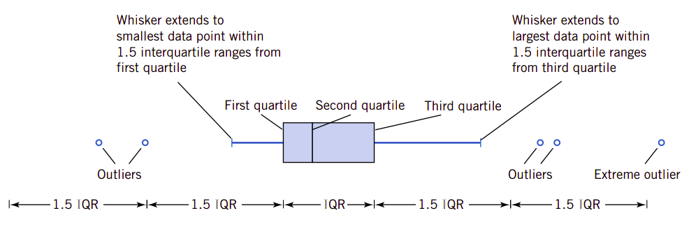

# 6、描述统计

统计就是关于数据的科学。处理数据的一个重要方面是要组织数据，也要直观地显示数据的特性，比如我们计算数据的平均值和方差，都是对数据的一种直观介绍。我们也会用图形的方法显示数据的特征。通过这些方法我们解释和处理数据，为后续的分析提供帮助。有关统计的这一方面的技术和内容我们称为**描述统计**。比如，我们在第一章的表1.1给出的一组混凝土立方抗压强度的数据43.8、43.2、45.0、48.4、45.8、41.2、46，1和45.3(MPa)。只是观察这一组数据我们就看到了数据的变动。那么，我们应该如何简单明了地显示这些数据的特征呢？当然，我们可以用平均值和方差。平均值代表了数据的中心位置，是以概率为权的加权平均值，而方差则代表了数据的集中程度。这种用数字显示一组数据的特征是一种很好的方法。但是我们还可以用强大的图形功能来显示这一组数据的特征。本章的重点就是介绍描述数据的方法。利用这些方法我们能更深刻地理解数据的特征。

!!!note "学习目标"
    
    仔细学习本章后，可以做到：

    1. 计算和解释样本的平均值、方差、标准差、中值和范围
    2. 解释样本平均值、方差、总体平均值和总体方差
    3. 构建和解释数据可视化图形，包括茎叶图、柱状图和框图
    4. 解释随机抽样的原理
    5. 构建和解释正态概率图
    6. 解释如何使用框图和其它数据图形可视化地比较两个或多个样本数据
    7. 知道如何使用简单的时序图可视化地显示面向时间数据的重要特征。
## 6.1、数据的数字化简要描述

对数据良好的数字化简要描述和图形化显示在本质上就是良好的统计思维方式，因为这样可以让工程师集中观察数据的重要特征，也能对数据提供一定的洞见，让工程师更方便地设想到解决问题的模型。利用计算机软件程序，无论是计算还是显示都十分便捷高效。本章的重点就是介绍使用不同的方式方法描述我们要分析和解释的数据。

我们常常使用数字化的方式来描述数据的特征。比如，我们常常用常见的算术平均值来刻画数据的中心位置。如果我们总是认为数据来自于样本，因此我们所指的算术平均值就是**样本平均值**。

!!!note "样本平均值"
    如果样本的$n$个观察值为$x_1,x_2,\cdots,x_n$，那么**样本平均值**就是：

    $$
    \begin{equation}
    \overline{x}=\frac{x_1+x_2+\cdots+x_n}{n}=\frac{\sum\limits_{i=1}^{n}x_i}{n}\qquad
    \end{equation}
    $$

!!!note "实例6.1"
    让我们考虑前面所提到的在混凝土配合比的水胶比等于0.42时，得到一组混凝土立方抗压强度样本值：43.8、43.2、45.0、48.4、45.0、41.2、46.1和46.1(MPa)。则利用公式(1)计算的样本平均值为44.8。

    如图6.1所示，样本平均值可以在物理上解释为混凝土立方抗压强度点图数据的中心位置的测量。当然，样本平均值$\overline{x}=44.8$还可以认为是“平衡点”。

!!!note "图6.1、样本平均值作为加权系统的平衡点"
    

在这里有必要解释样本值的概念。我们说样本，指的是从一个大的**总体**中抽出某些产品，这些被抽出的产品就是样本。一个样本它可能是半导体生成的晶圆，也可能是混凝土生产中的一组立方抗压试件。在设计混凝土配合比时，我们也会制作试件，此时要研究的混凝土总体还不存在，我们称这种总体为**概念总体**或**假设总体**。在混凝土生产过程中，我们也会抽取一定数量的样本制作试件，这时总体是物理存在的总体，可以称之为真实总体。

在前面几章我们讨论概率分布的平均值，我们用$\mu$表示。如果认为概率分布是总体的模型，那么也可以认为平均值就是对总体的所有的测量的平均值。对于只有$N$个样本的有限总体，如果所有样本的抽取概率都是相同的，即样本具有独立同分布的等似然性，则它的概率密度质量函数就是$f(x_i)=1/N$，并且它的平均值为：

$$
\begin{equation}
\mu=\sum\limits_{i=1}^{N}x_if(x_i)=\frac{\sum\limits_{i=1}^{N}x_i}{N}\qquad
\end{equation}
$$

所以样本平均值是总体平均值$\mu$的合理估计。因此，实例6.1中，工程师在设计混凝土配合比时，在0.42的水胶比时，可以得到的混凝土立方抗压强度值为44.8

样本平均值能反映数据的集中程度，但这些信息还不足以让我们洞察数据的特征。我们还需要数据分散程度的测量。这个测量就是**样本方差**或**样本标准差**。

!!!note "样本标准差"
    如果$x_1,x_2,\cdots,x_n$是$n$个观察值，则**样本方差**为：

    $$
    \begin{equation}
    s^2=\frac{\sum\limits_{i=1}^{n}(x_i-\overline{x})^2}{n-1}\qquad
    \end{equation}
    $$

    **样本标准差**为$s$，是样本方差的正平方根。

我们说方差是衡量数据分散程度的测量。假定所有样本的数据是一样的，那么它们都等于其平均值。如果有一个样本数据不在平均值上，则数据有了变动，也即数据有了分散性。这个分散性有多大呢，很自然地，我们会用$x_i-\mu$来衡量它的变动性。如果所有数据都不在平均值上，这种分散性是需要相加的。但是$x_i-\mu$有正有负，如果直接相加会抵消一定数量的变动值，这样的和并不能真正反映出数据变动的剧烈程度。我们需要用一个正值来衡量数据的变动程度，所以很直接地就想到了用$(x_i-\mu)^2$。因此平均变动程度就是样本方差。所以我们说样本方差能反映数据的变动或分散程度。样本方差$s^2$越大，则表明数据分散程度越大；$s^2$越小，反映数据的变动越小。

样本方差的计算公式(3)可以变换为：

$$
\begin{equation}
s^2=\frac{\sum\limits_{i=1}^{n}x_i^2-\frac{\left(\sum\limits_{i=1}^{n}x_i\right)^2}{n}}{n-1}\qquad
\end{equation}
$$

利用公式(4)可以直接计算样本方差，计算更简单。

模仿样本方差$s^2$，我们可以认为总体的变动可以用**总体方差**$\sigma^2$来描述。在前面我们就讨论过，$\sigma^2$的正平方根$\sigma$即为**总体标准差**。当总体有限，并且由$N$个等似然的值组成，则可以定义它的总体方差为：

$$
\begin{equation}
\sigma^2=\frac{\sum\limits_{i=1}^{N}(x_i-\mu)^2}{N}\qquad
\end{equation}
$$

我们已经知道，样本平均值可以用来估计总体的平均，类似地，样本方差也可以用来估计总体的方差。这就是我们要在[第七章](senven.md)讨论的**参数点估计**。

这里特别要指出的是，样本方差的计算时，在分母上要使用样本数量减1$n-1$而不是$n$，但计算总体方差时，则要用所有总体值的数量$N$。假设我们知道了总体的平均值$\mu$，则我们知道*样本*的方差就是所有样本观察值相对于$\mu$之差平方的平均值。但是在工程实践中，这个$\mu$往往是永远也不知道的，因此要用$\overline{x}$代替它。但是，$x_i$更接近于$\overline{x}$而不是$\mu$。所以，为了补偿这个差异，我们不得不在分母上使用$n-1$而不是$n$。如果我们在分母上使用$n$，那么平均来说，样本方差就会比总体方差小。这是一种解释。

另外一种解释就是，样本方差要使用$n-1$的**自由度**。自由度的概念来自于：所有的差值$x_1-\overline{x},x_2-\overline{x},\cdots,x_n-\overline{x}$的和总会为零，因此可以用这些差值的$n-1$个确定另外一个。因此，$n$个$x_i-\overline{x}$的值只有$n-1$个是可以自由确定的。

图6.2显示了总体平均值和方差与样本平均值和方差之间的关系。

!!!note "图6.2、总体与样本之间的关系"
    

样本方差与总体方差一样可以描述数据的分散程度。另外一种描述测量就是**样本范围**，也即是样本值的最大最小值之差。这个范围也是一种非常有用的数据分散描述。

!!!note "样本范围"
    设有$n$个样本观察值为$x_1,x_2,\cdots,x_n$，则**样本范围**为：

    $$
    \begin{equation}
    r=\text{max}(x_i)-\text{min}(x_i)\qquad
    \end{equation}
    $$

样本范围更容易计算，但它会忽略所有的处于最大和最小值之间样本值的信息。这是它的缺陷。当然，当$n<8$或$n<10$时，这种忽略还不太严重。比如在广泛使用的统计质量控制中，样本数量一般会只有4个或5个，这种忽略不会引起严重的问题。有关质量控制的内容，会在[第15章](fifteenth.md)中讨论。

## 6.2、茎叶图

小样本(小于等于20个数据)时用点图(如图6.1)显示数据比较方便。但是，当观察数据特别大时，就需要另外的图形来显示数据。比如，表6.1所示的铝锂合金的抗压强度值。该表共列出了80个试件的测试结果。表中数据按照测试顺序列出，并不能向我们传递更多的抗压强度信息。依据表格很难回答类似于“低于120psi的试件占总试件的百分率是多少？“的问题。由数据量相对庞大，构建点图效率低下，还有更高效的图形用于显示大数据集。

!!!note "表6.1、铝锂合金抗压强度"
    

**茎叶图**(stem-and-leaf diagram)显示数据的信息，这些数据由$x_1,x_2,\cdots,x_n$组成，并且$x_i$数据的数字位数至少有两个。为了构建茎叶图，需要遵循以下步骤：

!!!note "构建茎叶图的步骤"
    (1). 将每一个数字$x_i$分为两个部分：一个部分是**茎**，它由一个到两个前导数字组成，另一个部分则是**叶**，由$x_i$的其余部分组成。

    (2). 在垂直方向列出茎的值

    (3). 记录每一个观察值的叶

    (4). 在图中为茎和叶写下计量单位

只用文字叙述还不能完全表达如何编写茎叶图，我们可以用一个实例。表6.1给了我们足够的数据。

!!!note "实例6.2"
    在表6.1中，我们可以选择茎的值为$7,8,9,\cdots,24$。最终的茎叶图如图6.3所示。图中最后一列是与茎相关的叶子频数。通过这个茎叶图，立即可以看到大多数抗压强度值集中在110～200psi之间，其中心值在150～160psi之间的某一个位置上。另外，强度分布关于中心值近似对称。茎叶图能让我们快速确定数据的某些重要特征。我们只是查看表6.1很难洞察到这些特征。

!!!note "图6.3、表6.1所示抗压强度的茎叶图"
    

## 6.3、频率分布和柱状图

频率分布是比茎叶图更为紧凑的数据简要描述。频率分布将数据的分布区域分隔为相对较小的间隔，我们常常称这些间隔为**分类间隔**(class intervals)、**单元**(cell)或**箱**(bin)。如果可能，箱的大小应该尽量相同以便能更好地可视化显示数据所包含的内在信息。选择箱的大小和数量需要一些判断技巧，但与数据的分散程度也密切相关。太多的箱和太少的箱都不利用显示频率的内在信息。有一些规则可以让我们更方便地选择箱的数量。但是在实践中箱的数量近似等于样本数量的平方根常常非常有效。

以表6.1中合金的抗压强度为例，如果我们要绘制频率分布图，那么它的箱的个数$n=\sqrt{80}\approx 9$。因此可以假定需要8个到9个箱。数据的最大值为245，最小值为76，所以频率分布必须要覆盖$245-76＝169$的范围。如果希望第一个箱的下限比数据最小值要稍稍小一点，而数据最大值所在的箱的上限比最大值要大一点。因此我们可以覆盖70～250的范围。因此，如果有9个箱，则一个箱的宽度就是20psi。表6.2显示了表6.1合金抗压强度的频率分布。表的第一行是频数分布，第二行则是**相对频率分布**，第三行为相对频率分布的累计频率分布。

!!!note "表6.2、合金抗压强度的频率分布"
    

如果我们用真实的图形显示，或许会更为清晰。显示频率分布的图形常常是柱状图。构建柱状图的步骤如下：

!!!note "构建柱状图(等箱宽度)的步骤"

    (1). 在水平方向标注箱的边界

    (2). 在垂直方向标记频数或相对频率标记

    (3). 在每一个箱上绘制矩形，其高度等于相对于此箱的频数(或相对频率)

图6.4就是合金的抗压强度柱状图。与**茎叶图**一样，柱状图也以可视化的方式提供了测量数据分布的形态特征以及数据分布的中心趋势和分散趋势。图6.4还显示了分布的图形具有中心对称和钟形分布的形状，这常常让我们洞察到可以使用正态分布作为总体的模型。

!!!note "图6.4、合金的抗压强度柱状图"
    

在柱状图中，我们也可以使用不等宽箱。如果在观察数据中有几个极限数据，如果使用等宽箱则有可能几乎所有的观察数据会落在很少的几个箱中。如果使用许多个等宽的箱，则很多箱的频率几乎会为零。更好的办法是在数据集中的区间使用较小的箱，而在极限观察点附近使用更宽的箱。当箱的宽度不相同时，柱状图的矩形**面积**(非矩形高度)就应该保持与频率的比例。这就要求矩形的高度为：

$$
\text{矩形高度}=\frac{箱的频率}{箱的宽度}
$$

与使用原始数据或茎叶图相比较，使用频率图会损失某些信息，原因在于频率图并不能显示单独的观察数据。但这种损失与频率图所清晰表达的信息相比则是微不足道的。

图6.5是合金抗压强度的一种频率图，它的箱数量较多、箱宽较短。图6.6则是合金的抗压强度的另一种频率图，它的箱数量较少、箱宽度较大。可以看到，柱状图的形状相对于箱的数量和箱宽度比较敏感。对于小数据集，如果箱的数量或宽度变化，则柱状图的外观会发生剧烈变化。对于大的数据集比如75-100个数据，或更多的数据，则柱状图更为稳定。

!!!note "图6.5、合金抗压强度有十七个箱的频率图"
    

图6.6与图6.4非常相似。
!!!note "图6.6、合金抗压强度的另一个有九个箱的频率图"
    

由于我们所提供的合金抗压强度的数据集相对较大($n=80$)，因此选择箱的数量和宽度并不十分重要。图6.5和6.6都能恰当地反映类似的信息。

还可以用柱状图来反映累积频率分布，这种频率图称为**累积频率图**，每一个柱的高数就是总的观察数据小于或等于箱的上限的总数据数量。在解释数据时常常要用到累积分布图，比如可以直接从图6.7中看到小于或等于200psi的数据大约有70个。

!!!note "图6.7、合金抗压强度累积分布图"
    

当样本数量很大时，柱状图可以为我们提供来自样本数据的、关于测量的总体或分布合理可靠的图形形状。图6.8呈现了三种情况。中值用$\tilde{x}$表示。一般地，如果数据是对称的，如图6.8(b)所示，则平均值和中值是重合的。如果数据只有一种模式(我们说数据是*单峰的*，unimodal)，则平均值、中值和峰值都是重合的。如果数据是歪斜的(非对称的，在一边有长尾)，如图6.8(a)和6.8(c)所示，则平均值和峰值并不会重合。通常情况下，如图图形向右歪斜，则会发现$\text{峰值}<\text{中值}<\text{平均值}$，如果分布是向左歪斜，则$\text{峰值}>\text{中值}>\text{平均值}$。

!!!note "图6.8、对称和歪斜分布的柱状图"
    

分类数据也可以使用频率分布图和柱状图。在某些应用中，某此分类有自然的顺序(比如新生、大二、大三和大四学生)，而有的则是无顺序的分类(比如男性和女性)。当使用分类数据时，箱的宽度是相等的。

在这一节中我们主要关注的是描述数据集中每一个观察数据都只有单一的数值或属于一个分类。在许多情况下，每一个观察都由几个测量组成。比如，在研究汽车的油耗时，数据往往由英里每加仑、汽车引擎大小、引擎功率、汽车重量以及汽车长度组成。这是典型的**多变量数据**的实例。在后续的章节中，我们会讨论如何分析这种类型的数据。

## 6.4、箱图

茎叶图和柱状图提供了数据集的一般视觉图形，而数字数量，比如$\overline{x}$或$s$只提供了数据的一项特征。**箱图(box plot)**则是可以同时描述数据集几个重要特征的图形，它可以描述数据集的中心、散布、对称偏离，并识别异常观察数据。

箱图有数据集的三个四分位线、最小值以及最大值，它们可以垂直也可以水平排列。箱的左侧(或底部)由第一个四分位线构成$q_1$，右侧(或顶部)由第三个四分位线$q_3$构成。在箱的内部有一条线，它是第二条四分位线(或中间值)$q_2=\overline{x}$。中间值(median)是整个数据集中最中间的数。如果数据集中数据个数为偶数，则中间值是整个数据集中最中间两个数的平均数。中间值将数据集的数分为两个部分，每一个部分各有50％的数据值。$q_1$是将中间值以下的数据子集再分为两个子集的值。这个子也是事个数据集的中间值与整个数据最小值之间的中间值。如果中间值与最小值之间的数据个数为偶数，则$q_1$是$q_2$与最小值之间中间两个数的平均值。同理，$q_3$是$q_2$与最大值之间的中间值。如果$q_2$与最大值之间的数据个数为偶数，则$q_3$是两个中间值的平均值。我们定义箱底部和顶部之间的区域为中间区域，即IQR，我们有$\text{IQR}=q_3-q_1$。

还有一组线，我们称为**须线**(whisker)，它扩展了箱的终端。底部的須线在从第一条四分线开始到1.5倍IRQ的最小点处。顶部的須线在从第三条四分位线开始到1.5倍IQR的最大点处。远离須线、但从箱的边缘开始到3倍IQR范围内的数据值为**离散值**(outlier)。从箱的连线开始超出3倍IQR的点称为**奇异值**(extreme outlier)。具体的箱图可见图6.9。

!!!note "图6.9、具体的箱图示意"
    

偶尔地我们也会用不同的符号，比如空心圆和实心圆来表示两种类型的奇异值。有时箱图又称为*箱和須线图*。

对于合金抗压强度数据集，我们可以绘制箱图。箱图表示了抗压强度值围绕中值是对称的，因为左右須线和围绕中值的左右箱也大致是相同的，见图6.10所示。

!!!note "图6.10、合金抗压强度的箱須线图"
    
为了了解这个图的作图过程，我们可以先把表6.1的数据排序，可以得到表6.2.

!!!note "表6.2、经过排序后的合金抗压强度数据集"
    <table>
    <tr><td>76 </td><td>87 </td><td>97 </td><td>101</td></td><td>105</td></td><td>110</td></td><td>115</td></td><td>118</td></td><td>120</td></td><td>121</td></tr>
    <tr><td>123</td><td>131</td><td>133</td><td>133</td></td><td>134</td></td><td>135</td></td><td>135</td></td><td>141</td></td><td>142</td></td><td>143</td></tr>
    <tr><td>144</td><td>146</td><td>148</td><td>149</td></td><td>149</td></td><td>150</td></td><td>150</td></td><td>151</td></td><td>153</td></td><td>154</td></tr>
    <tr><td>154</td><td>156</td><td>157 </td><td>158</td></td><td>158</td></td><td>158</td></td><td>158</td></td><td>160</td></td><td>160</td></td><td>160</td></tr>    
    <tr><td>163</td><td>163</td><td>165</td><td>167</td></td><td>167</td></td><td>168</td></td><td>169</td></td><td>170</td></td><td>171</td></td><td>171</td></tr>
    <tr><td>172</td><td>174</td><td>174</td><td>175</td></td><td>176</td></td><td>176</td></td><td>178</td></td><td>180</td></td><td>180</td></td><td>181</td></tr>
    <tr><td>181</td><td>183</td><td>184</td><td>186</td></td><td>190</td></td><td>193</td></td><td>194</td></td><td>196</td></td><td>199</td></td><td>199</td></tr>
    <tr><td>200</td><td>201</td><td>207</td><td>208</td></td><td>218</td></td><td>221</td></td><td>228</td></td><td>229</td></td><td>237</td></td><td>245</td></tr>
    </table>

由于抗压强度值共有80个，排序后的20和21个数据都处于中间位置，它们分别是160和163。则数据集的中间值应该是161.5。这个值正好把80个数据分为两个部分，上半部分所有的数据值都大于中间值，而下半部分所有的数据都小于中间值。这时$q_2=161.5$。再下半部分，中间的两个数据分别是143和144，所以其中间值为这两个数据值的平均值$q_1=143.5$。在上半部分，中间的两个数据值是181和181，因此$q_3=181$。

在低强度区还有两个中等的奇异值，在高强度区也有一个更高的奇异值。上须线扩展观察值到237，因为它是上奇异值的最大值。这个限值为$q_3+1.5\text{IQR}=181+1.5(181-143.5)=237.25$。低须线扩展观察值到97，因为它是低奇异值线上的最小观察值。这个限值就是$q_1-1.5\text{IQR}=143.5-1.5(181-143.5)=87.25$

!!!note "图6.11、三个生产厂的生产质量指数比较"
    

箱图在数据集的比较中非常有用，原因就在于它具有很高的视觉冲击效果。比如，图6.11显示了三个生产厂的半导体设备生产质量指数的比较结果。这个图揭示出生产厂2有太多的变动，并且生产厂2和3都必须提高它们的生产质量指数。

## 6.5、时序图

!!!note "重要概念"
    
    1.
