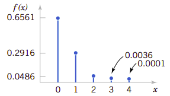
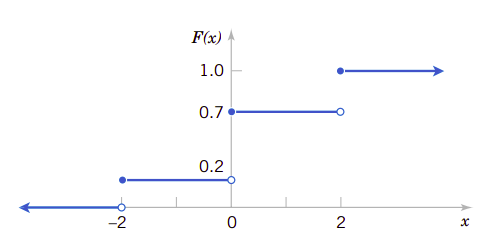
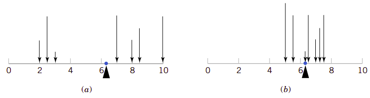
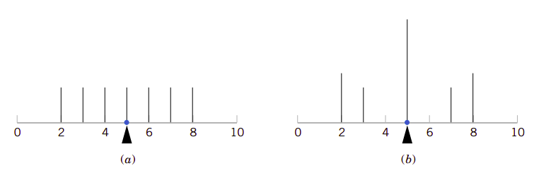
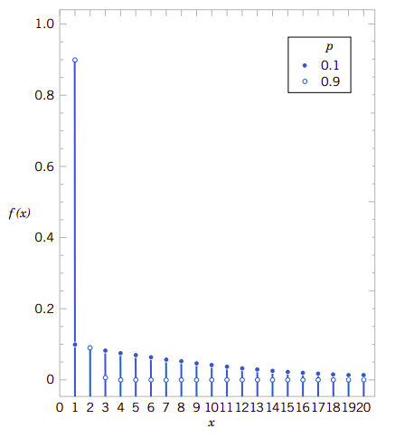
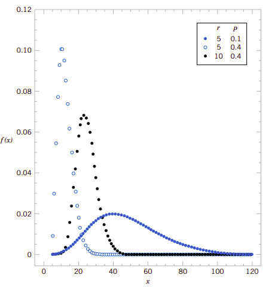
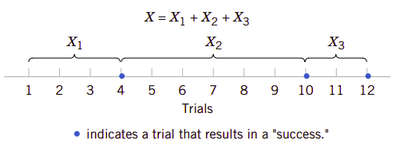

# 3、离散随机变量及其概率分布

在[第2章](second.md)我们介绍了概率的基础知识，最后一节(2.8)特别介绍了随机变量。随机变量是一个函数，它为随机实验的样本空间分配一个具体的数字。

在医院急诊科，前来急诊的病人有时会多，有时会少，是随机变动的。因此我们可以用随机变量来表示某一个时刻急诊科就诊总人数。通过观察，可以分析就诊病人在每一天的分布情况，由此可以分析急诊科的资源配置是否满足要求，在现有配置下不满足要求的风险有多大。这是本章主要的研究内容。

!!!note "学习目标"

    经过仔细学习本章后，可以做到：
    
    1. 从概率质量函数确定概率，或相反从概率确定概率质量函数
    2. 从累积分布函数确定概率，从概率质量函数确定累积概率分布函数，或相反。
    3. 计算离散随机变量的平均值和方差。
    4. 理解某些常用离散概率分布的假设。
    5. 选择适当的离散概率分布，计算特定应用的概率。
    6. 为某些常用的离散概率分布计算概率、确定平均值和方差

## 3.1、离散随机变量

许多系统，比如[第2章](second.md)的蒸馏实例，再比半导体生产，甚至于水泥生产、混凝土生产及浇筑等等系统，都可以用相同或相似的随机实验来模拟建模，它们都有相同的抽象模型。人们可以分析这些常见模型的随机变量分布，它们的结果又能用于其它领域的工程实例中。这是人类认识世界的模式，即举一返三的模式。在本章我们要分析少量几个常用常见的随机实验和**离散随机**变量。由于在随机实验这个抽象模型的基础上讨论，所以我们常常可以忽略具体系统底层的样本空间而直接描述特定随机变量的分布。

!!!note "实例3.1"
    商业用语音通讯系统常常包含48条外线。在某一特定时刻，观察系统会发现某些线路正在被使用。设随机变量$X$表示正在使用的线路数量。那么$X$可以是$\{0,1,\cdots,48\}$之间的任何整数。当观察到系统正有10条线路在使用时，则$x=10$。

!!!note "实例3.2"
    混凝土生产强度等级C30的普通混凝土。针对连续生产的180方混凝土，我们取两次样检测其强度。检测结果有*合格*(pass)和*不合格*(fail)两个结果。假定混凝土强度合格的概率为0.95，并且两次抽样是随机独立的。如表3.1显示了随机实验的样本空间和相关的概率。比如，因为独立性，则第一组试件合格第二级试件不合格的概率的随机变量$X$取值为$pf$，它的概率为:

    $$
    P(pf)=0.95(0.05)=0.0475
    $$

    在这个实例中，随机变量$X$被定义为合格试件组数。

!!!note "表3.1、混凝土检测"

    |试件组1|试件组2|概率|$x$|
    |--|--|--|--|
    |pass|pass|0.9025|2|
    |fail|pass|0.0475|1|
    |pass|fail|0.0475|1|
    |fail|fail|0.0025|0|

由实例3.2可知，针对连续生产的混凝土抽取两组试件，只要生产稳定可控，两组试件都不合格的概率是微乎其微的，即使有一组不合格的概率也只有9.5％，应该很少发生。如果生产过程中发生了，表明这是一个强烈的信号，告诉我们生产过程中可能有应该控制的因素未控制好，需要去查找原因解决问题。

## 3.2、概率分布和概率质量函数

随机变量是对随机实验结果的映射函数，可以用来描述非常多系统的随机过程。要用好它，则凸现了其性质的重要性。因此我们在讨论时往往会更关注它的概率分布而忽略它的底层原因。比如在3.1节中的两个实例中，我们常常关注随机变量的在$\{0,1,\cdots,48\}$中的取值。同样地，在实例3.2中，我们也常常关心随机变量在$\{0,1,2\}$上的取值。

随机变量$X$的**概率分布**描述该变量某一特定值的概率。对于本章研究的离散随机变量，分布常常由一个列表组成。该列表列出了每一个随机变量取值所对应的概率。在某些情况下，用一个公式表达这些概率也是很方便的。

!!!note "实例3.3"
    在通过数字转换的过程中有可能会接收到错误的数字位。设$X$等于接下来四个数字位接收到错误位数，可能的值就是$\{0,1,2,3,4\}$。下面的数据给出了依据模型所得到概率。假定如下：

    $$
    \begin{align}
    P(X=0)&=0.6561 &\qquad P(X=1)=0.2916 \nonumber\\
    P(X=2)&=0.0486 &\qquad P(X=3)=0.0036 \nonumber\\
    P(X=4)&=0.0001 \nonumber
    \end{align}
    $$

    $X$的概率分布就是它的每一个取值与对应的概率之间的关系。我们可以用图形来表达这种关系。事实上概率分布就是一种函数，即由随机变量取值与它随机实验时获得该值的概率。图3.1表达了这种关系。

!!!note "图3.1、错误转换数字数的概率分布"
    

!!!note "概率质量函数"
    离散变量$X$它的可能取值为$\{x_1,x_2,\cdots,x_n\}$的**概率质量函数**(probability mass function)就是函数：
    
    $$
    \begin{align}
    &\text{(1)}\space f(x_i)\geq 0 \nonumber \\
    &\text{(2)}\space \sum_{i=1}^{n}f(x_i)=1 \nonumber \\
    &\text{(3)}\space f(x_i)=P(X=x_i) \qquad \qquad
    \end{align}
    $$

根据概率质量函数的定义，实例3的各个函数值为$f(0)=0.6561$、$f(1)=0.2916$、$f(2)=0.0486$、$f(3)=0.0036$以及$f(4)=0.0001$。全部相加的各为1。

## 3.3、累积分布函数

!!!note "实例3.4"
    在实例3.3中，我们可能会更关心随机变量取前三个错误位或更少的概率。因此问题可以描述为$P(X\leq 3)$。
    事件$X\leq 3$是三个事件$\{X=0\}$、$\{X=1\}$联合事件、$\{X=2\}$和$\{X=3\}$的联合事件。因为这几个事件都是互斥事件，所以有:

    $$
    \begin{align}
    P(X\leq 3) &= P(X=0)+P(X=1)+P(X=2)+P(X=3)\nonumber \\
    &=0.6561+0.2916+0.00486+0.0036=0.9999 \nonumber
    \end{align}    
    $$

    利用这个方法，还可以确定概率分布。即：
    $$
    P(X=3)=P(X\leq 3)-P(X\leq 2)=0.0036
    $$

从实例3.4我们知道，提供诸如$P(X\leq 3)$这样的**累积概率**用于分析和研究是非常有帮助的，使用累积概率还能方便地确定概率质量函数。因此 ，累积概率代替概率质量函数用于描述随机变量也是非常好的方法。

一般地，对于任意可能取值为$\{x_1,x_2,\cdots,x_n\}$的离散随机变量，事件$\{X=1\},\{X=2\},\cdots,\{X=n\}$是互斥事件，因此有$P(X\leq x)=\sum_{x_i\leq x}f(x_i)$。

!!!note "累积分布函数"

    用$F(x)表示离散随机变量$X$的**累积分布函数**(cumulative distribution function)，它应该是：

    $$
    F(x)=P(X\leq x)=\sum\nolimits_{xi\leq x}f(x_i)
    $$

    离散随机变量$X$的累积概率函数$F(x)$应该满足以下条件：

    $$
    \begin{align}
    &\text{(1)}\space F(x)=P(X\leq x)=\sum\nolimits _{x_i\leq x}f(x_i) \nonumber\\
    &\text{(2)}\space  0\leq F(x)\leq 1 \nonumber\\
    &\text{(3)}\space \text{If}\space x\leq y,\space \text{then}\space F(x)\leq F(y)\qquad\qquad
    \end{align}
    $$

累积分布函数的性质(1)和(2)是由它的定义所决定的。而性质(3)则是因为事件的包含性决定的。因为如果$x\leq y$，则事件$\{X\leq x\}$包含在事件$\{X\leq y\}$中。你概率质量函数一样，累积概率函数也提供概率。即使只假定随机变量$X$只取整数值，累积分布函数也可以被定义为非整数值。在实例3.4中，可以有$F(1.5)=P{X\leq 1.5}=P(X=0)+P(X=1)=0.9477$。下面我们用实例解释如何用累积分布函数计算概率质量函数。

!!!note "实例3.5"

    从下面给出的随机变量$X$的累积分布函数计算它的概率质量函数：

    $$
    F(x)=
    \begin{cases}
        &0      &\qquad x< -2 \\
        &0.2    &\qquad x-2\leq x <0 \\
        &0.7    &\qquad 0\leq x <2 \\
        &1      &\qquad 2\leq x       
    \end{cases}
    $$

    图3.2显示了$X$的累积分布函数。从图中我们看到，只有点$\{-2,0,2\}$才接受非零概率。每一个点的概率质量函数它的累积分布函数在该点的变化量。因此我们有：

    $$
    \begin{align}
    f(-2) &=0.2-0=0.2\nonumber\\
    f(0)  &=0.7-0.2=0.5\nonumber\\
    f(2)  &=1.0-0.7=0.3\nonumber
    \end{align}
    $$

!!!note "图3.2、实例3.5的累积分布函数"
    

## 3.4、离散随机变量的平均值和方差

有两个非常重要的数，它们可以描述随机变量概率分布的中心位置和分散程度(或变动程度)。它们就是平均值和方差。这两个数并不能唯一地描述概率分布。也即是说两个不同的分布有可能会有相同的平均值和方差。这有点类似于混凝土用砂的细度模数。细度模数可以描述砂子的粗细程度，但并不能唯一确定其级配。因为不同的筛分结果有可能会得到相同的细度模数。像这类数据，比如随机变量的平均值和方差，像混凝土用砂的细度模数，都是对事物某一性质的概要描述，并是能决定它们的性质，但却给我们非常强制信息，是非常重要的一类数据。

!!!note "平均值和方差"
    离散随机变量$X$的**平均值**(mean)或**期望值**(expected value)用$\mu$表示，它由下述公式(3)确定。

    $$
    \begin{equation}
    \mu=E(X)=\sum_{x}xf(x) \qquad\qquad
    \end{equation}
    $$

    $X$的**方差**(variance)用$\sigma^2$表示，它等于:

    $$
    \sigma^2=V(X)=E(X-\mu)^2=\sum_x(x-\mu)^2f(x)=\sum_xx^2f(x)-\mu^2
    $$

    $X$的**标准差**(standard deviation)为$\sigma=\sqrt{\sigma^2}$。

$X$的平均值实质上是它取值的加权平均值(weighted average)，其权就是每一个可能值的概率。如果概率质量函数$f(x)$是细长梁上的荷载，那么$E(x)$就是梁的平衡点。同样地，$E(X)$用类似于平衡点的方式描述的是$X$分布的“中心点”。图3.3描述了这种类似性。

随机变量$X$的方差则是它的可能值的分散程度的量度。方差针对$(x-\mu)^2$做加权平均，其权就是$f(x)$。

图3.3例示了平均值相同但方差不同的概率分布。

!!!note "图3.3、概率分布可以视为细长梁上的荷载，其平均值就是平衡点。"
    

即使平均值和方差完全相同，随机变量的概率也可能不相同。图3.4例示了这一点。

!!!note "图3.4、有相同平均值和方差的不同分布"
    

再看看方差的定义，它实质上是随机变量$X$的某一个函数的期望值，在这里这个函数就是$h(X)=(X-\mu)^2$。一般地，任何随机变量$X$的函数$h(X)$的期望值可以用类似的方式来定义：

!!!note "离散随机变量函数的期望值"
    如果$X$是离散随机变量，其概率质量函数是$f(x)$，则它的函数的期望值为：

    $$
    \begin{equation}
    E[h(X)]=\sum_{x}h(x)f(x)\qquad\qquad
    \end{equation}
    $$

## 3.5、几个重要的离散随机变量分布

人们经过大量的工程实践和研究，已总结出了大量的离散随机变量的分布函数。我们只是择要介绍几个工程和生活中常常可以用到的重要分布。

### 3.5.1、离散均匀分布

最简单的离散随机变量分布就是离散均匀分布。假定随机变量的可能取值为$\{x_1,x_2\,cdots,x_n\}$，且每一个取值的概率都相等，即$1/n$。这是一个非常有用的分布。

!!!note "离散均匀分布"
    随机变量$X$的是**离散均匀分布**(discrete uniform distribution)，只要它的可能的$n$个值的概率完全相同，那么有：

    $$
    \begin{equation}
    f(x_i)=1/n \qquad\qquad
    \end{equation}
    $$

    假设离散随机变量$X$的可能取值为连续整数$\{a,a+1,a+2,\cdots,b\}\text{for}\space a\leq b$，则它的平均值为：

    $$
    \mu=E(X)=\frac{a+b}{2}
    $$

    其方差为：

    $$
    \begin{equation}
    \sigma^2=\frac{(b-a+1)^2-1}{12}\qquad
    \end{equation}
    $$

### 3.5.2、二项式分布

设想下面的随机实验和随机变量：
1. 抛一个硬币10次，设$X=正面向上的次数$。

2. 有磨损的机床会产生1％的次品，设$X=25个产品中的次品数$。

3. 每一个空气样本中都有10％的可能包含一个罕见的分子。设$X=18个空气样本中包含罕见分子的样本数$。

4. 所有数字位通过数字传输通道后，有10%的可能收到错误数字位。设$X=5个接收位中错误位的个数$。

5. 多问题选择的测验中，共有10个问题，每一个有四个答案，假设每一个问题都用猜测来回答。设$X=回答正确的问题数$。

6. 在医院诞生的20个婴儿。设$X=诞生的男婴数量$。

7. 所有患特殊病的患者中，服用特定药物后有35％的可能病情得到改善。在100个服用此药物的患者中，设$X=病情改善的患者数量$。

所有这些随机实验都有一个共同点，例示了一个通用的概率模型。这些实验都由一系列重复的随机判决组成：在实验1中的抛硬币、实验2中25个零件的次品数等等。每一种情况下的随机变量都是与满足某种判决条件有关的数量。每一次判决又都可以抽象为判决*成功*(success)和*失败*(fail)两个结果。在这里成功和失败判决只是一个标签，事实上我们也可以用A和B来代替，也可以用0和1代替。

只有两个可能结果的判决可以视为一个模块，常常用于构建概率模型的模块称为**伯努利判决**(Bernoulli trial)的随机实验。这个判决常常假定构成判决的随机实验是**独立**的。这也表示一次判决对下一次判决没有影响。另外，假定**每一次成功判决的概率是常数**也是一种合理的假设。在多问题多选择测试中，如果应试者完全没有测试题目的相关知识，他只是猜测答案，则可以假定*每一个题目*他选择正确答案的概率为$1/4$。

由这些实例，我们可以抽象出二项式分布的概率分布模型。

!!!note "二项式分布"

    随机实验由$n$个伯努利判决组成，它们满足：

    (1)&nbsp;&nbsp;判决实验是独立的

    (2)&nbsp;&nbsp;每一次判决实验只有两个结果，标记为“成功”和“失败“。

    (3)&nbsp;&nbsp;用$p$表示每一次判决成功的概率，它是一个常数。

    随机变量$X$等于成功的判决数就是一个二项式随机变量，它的参数是$0<p<1$和$n=0,1,2,\cdots$。则$X$的概率质量函数为：

    $$
    \begin{equation}
    f(x)=C_x^np^x(1-p)^{n-x} \qquad x=0,1,2,\cdots\qquad
    \end{equation}
    $$

    其中：

    $$
    C_x^n =
    \begin{pmatrix}
        n\\
        x
    \end{pmatrix} =\frac{n!}{x!(n-x)!}
    $$

按组合数学的结论，$C_x^n$表达了$x$次成功和$n-x$次失败的判决实验结果的总数。公式(7)所表示的概率分布是非常有用的公式，可以用到许多工程和生活的实例中去。这个分布之所以称为二项式分布，有两个来源。第一个来源于*二项式展开式*。对于常数 $a$和$b$，二项式的展开式为：

$$
(a+b)^n=\sum_{k=0}^n
\begin{pmatrix}
n\\
x
\end{pmatrix}
a^kb^{n-k}
$$

设$p=a$和$b=1-p$，则上式右边的和就是概率之各，左边则等于1，表明概率总合为1，满足概率公理。这表明二项式分布的概率可以将成功和失败的概率视为二项的两项。另外一个含义则是它的判决实验只有可能的取值。

!!!note "实例3.6"
    每一个水的样本都有10％的可能包含有特定的有机污染物。假定样本是从有污染的水源中独立抽取的。试求在18个样本中正好有2个样本中含有污染物的概率。

    设$X＝18个样本中包含有污染的样本数$。则$X$是二项式随机变量，其参数为$p=0.1$和$n=18$。因此：

    $$
    P(X=2)=
    \begin{pmatrix}
    18\\
    2
    \end{pmatrix}
    (0.1)^2(0.9)^{16}=0.284
    $$

    我们再计算至少有4个样本包含污染物的概率：

    $$
    P(X\geq 4)=\sum_{x=4}^{18}
    \begin{pmatrix}
    18\\
    x
    \end{pmatrix}(0.1)^x(0.9)^{18-x}
    $$

    这样需要计算14项，但依据概率公理，我们有:

    $$
    \begin{align}
    P(X\geq 4)&=1-P(X<3)\nonumber\\
    &=1-\sum_{x=0}^{3}
    \begin{pmatrix}
    18\\
    x
    \end{pmatrix}
    (0.1)^x(0.9)^{18-x}\nonumber\\
    &=1-[0.150+0.300+0.284+0.168]\nonumber\\
    &=0.098\nonumber
    \end{align}
    $$

    只需要计算多项式展开式的四项。

    还可以计算$X$在$[3,7)$内的概率：

    $$
    \begin{align}
    P(3\leq X< 7)&=\sum_{x=3}^{6}
    \begin{pmatrix}
    18\\
    x
    \end{pmatrix}(0.1)^{x}(0.9)^{18-x}\nonumber\\
    &=0.168+0.070+0.022+0.005\nonumber\\
    &=0.265\nonumber
    \end{align}
    $$

[累积二项分布概率表](http://www.math.hawaii.edu/~xander/fa12_471/Binomial_Probabilities.pdf)(table of cumulative binomial probability)可以用来快速计算二项分布的概率。比如，如果$p=0.1$并且$n=4$，则可以按下述方法计算$P(X=2)$：

$$
P(X=2)=P(X\leq 2) - P(X\leq 1)=0.9963-0.9477=0.0486
$$

二项分布的平均值和方差可以按其定义得到。

!!!note "二项式分布的平均值和方差"
    如果$X$是二项式分布随机变量，其参数为$p$和$n$，则它的平均值和方差为：

    $$
    \begin{align}
    \mu=E(X)=np \qquad \text{和}\qquad \sigma^2=V(X)=np(1-p) \qquad
    \end{align}
    $$

### 3.5.3、几何分布和负二项式分布

#### 3.5.3.1、几何分布

设想一个与二项式分布特别相关的随机实验。假定有一系列的伯努利判决实验(独立的随机实验，每一次都有相同的成功概率$p$)。但是实验次数并非固定的，实验一直进行下去直到出现第一次成功实验为止。比如，从一批零件中一直抽样检验，直到检查到第一个次品零件为止。则随机变量$X$的取值就是此时所执行的检验次数。

我们可以把实验验分为前后几步，这样的随机事件变成了条件事件，可以用乘法得到它的概率。

!!!note "几何分布"
    在一系列的伯努利判决实验(独立判决，每一次成功的概率都为常数$p$)中，判决实验一直执行直到第一次出现成功的为止。设随机变量$X$表示此时共计执行的判决实验次数，$X$即为**几何随机变量**，其参数为$0<p<1$，并且：

    $$
    \begin{equation}
    f(x)=(1-p)^{x-1}p \qquad x=1,2,\cdots\qquad
    \end{equation}
    $$

图3.5是几何随机变量的概率质量函数。注意，在$x$处线的高度只有$x-1$处高度的$(1-p)$倍。这表明概率按几何级数的方式递减。这是这个随机变量取名由来。

!!!note "图3.5、参数为$p$的几何概率分布"
    

很容易依据定义计算几何分布的平均值和方差。

!!!note "几何分布的平均值和方差"
    如果$X$是几何随机变量，其参数为$p$，则其平均值和方差为：

    $$
    \begin{equation}
    \mu=E(X)=1/p\qquad\text{和}\qquad\sigma^2=V(X)=(1-p)/p^2\qquad
    \end{equation}
    $$

**缺乏记忆**的性质：
几何随机变量定义为判决实验一直执行直到第一次出现成功的判决时共计执行的判决实验次数。但是由于判决实验是独立的，直到下一次成功之前所有的判决实验都不会改变随机变量的概率分布。比如，在信息传输系统中，之前已传输了100位，之后在106位时接收到错误的数字位，这时它的概率与6位时出现成功的概率相同，这个概率就是$(0.9)^5(0.1)=0.059$，它与发生错误发生在第6位时的概率完全相同。

这意味着使用几何模型要求系统永远没有磨损，在整个传输过程中错误率保持不变。正是在这种意义上，我们称几何分布没有记忆。

#### 3.5.3.2、负二项式分布

将几何分布推广一步，判决实验一直进行下去，直到有$r$次成功为止。这时随机变量是此时执行的判决试验次数。这个随机变量的分布就是**负二项式分布**。这与二项式分布是不同的。二项式分布是有一个总的判决执行次数，而随机变量取值是有$r$个成功次数。而负二项分布是没有判决实验执行限制，只要出现$r$成功即停止。且变量取值是此时执行的判决实验次数。

!!!note "负二项式分布"
    在一系列伯努利判决实验(独立判决，成功概率为常数$p$)中，设随机变量$X$表示判决实验出现$r$次成功时共计执行的判决次数。则随机变量$X$就是参数为$0<p<1$ 并且 $r=1,2,3,\cdots$ 的**负二项式分布**, 并且有：

    $$
    \begin{equation}
    f(x)=\begin{pmatrix}
    x-1\\
    r-1
    \end{pmatrix} (1-p)^{x-r}p^r\qquad x=r,r+1,r+2,\cdots\qquad
    \end{equation}
    $$

因为需要$r$次成功，所以执行的判决实验次数至少得有$r$次，因此$X$的取值就是$[r, \infty]$。如果$r=1$成变成了二项式分布。图3.6绘制了某些负二项分布的图形。

!!!note "图3.6、某些负二项式分布"
    

设$X$表示获得$r$次成功时的判决实验次数，$X_1$是获得第一次成功时判决实验成功的次数，设$X_2$表示从第一次成功后第二次再获得成功的判决实验次数，$X_3$是第二次获得成功后到第三次获得成功时判决实验的次数，等等。每一个这样的随机变量都是几何分布。所以获得$r$次成功判决后的总次数$X=X_1+X_2+\cdots+X_r$。几何分布没有记忆性，并且每一个几何分布随机变量都是独立的随机变量，且每一次判决实验都有相同的$p$。这样负二项式分布就可以解释为$r$个几何随机变量之各。图3.7例示了这一概念。

!!!note "图3.7、负二项式分布可以表达为几何分布的和"
    

还记得二项式分布就是$n$次判决实验中成功的次数。也就是说这个数值是预先指定的，并且成功次数是随机的。而负二项分布随机变量是获得$r$次成功后执行判决实验的次数。也就是成功次数是预先指定的，而判决实验的次数是随机的。在这种意义上，负二项式随机变量可以认为是相反的，或负的二项式随机变量。依据平均值和方差的定义以及负二项分布是几何随机变量之和的概念，我们可以确定负二项式随机变量的平均值和方差。

!!!note "负二项式的平均值和方差"
    如果$X$是负二项式随机变量，其参数为$p$和$r$，则：

    $$
    \begin{equation}
    \mu=E(X)=r/p\qquad\text{和}\qquad\sigma^2=V(X)=r(1-p)/p^2\qquad
    \end{equation}
    $$

!!!note "实例3.7"
    一个Web站点准备了三台完全相同的计算机服务器，其中一台服役，另外两台备用。只要服役的计算机失效，则立即激活另外一台服役。每一台激活的服务器的请求服务的失效概率都是0.0005。假定每一次请求就是一次独立判决实验，那么直到3台都失效的请求平均值会是多少呢？

    设$X$表示直到3台服务器都失效的请求数，$X_1,X_2$和$X_3$表示第1台、第2台、和第3台服务器失效之前的请求数。现在$X=X_1+X_2+X_3$。同时假定请求都 是独立的，且失效概率就是$p=0.0005$。另外，每一台预备服务器在它被激活之前都不会受请求次数的影响。因此，$X$就是一个负二项式分布，其参数为$p=0.0005$、$r=3$。三台服务器都失效的平均请求次数为:

    $$
    E(X)=3/0.0005=6000
    $$

    现在我们再来分析三台服务器在五次请求内都失效的概率是多少呢？这个概率是$P(X\leq 5)$。因为$X$表示第3台服务器失效，所以有$P(X\leq 2)=0$。因此:
    
    $$
    \begin{align}
    P(X\leq 5)&=P(X=3)+P(X=4)+P(X=5)\nonumber\\
    &=0.0005^3+\begin{pmatrix}3\\2\end{pmatrix}0.0005^3(0.9995)\nonumber\\&\qquad{}+\begin{pmatrix}4\\2\end{pmatrix}0.0005^3(0.9995)^2\nonumber\\&=1.249\times 10^{-9} \nonumber
    \end{align}
    $$

    因为判决实验都是独立的，所以到第3台服务器失效时的判决实验的平均值是第1台服务器失效时请求平均值的3倍。

这是以WEB服务器为例的。如果我们以混凝土搅拌机为例，以每搅拌一盘为一次判决实验，只要知道机器每搅拌一盘的失效概率，我们就能模拟搅拌机失效的平均搅拌次数。

#### 3.5.4、泊松分布

当把二项式分布的判决实验次数推广到无穷大时，分布的平均值会保持为一个常数，这就是泊松分布，是一个具有广泛用途的随机分布。

!!!note "实例3.8"
    沿着细长铜导线上会随机地产生缺陷。设$X$表示一个随机变量，表示在长度为$L$的导线上产生缺陷的数量，并且假定在$L$长度上平均缺陷数为$\lambda$。设想将铜导线分割为$n$个小的子区间。如果子区间选择足够小，则在子区间中多于1个缺陷的概率就可以忽略不记。另外，我们缺陷是随机发生的，所以可以认为每一个子区间有相同的概率包含缺陷，设这个概率为$p$。最后再假定子区间包含一个缺陷的概率是彼此独立的，则可以建模$X$的分布为近似二项式随机变量。因为：

    $$
    E(X)=\lambda=np
    $$

    所以可以得到：

    $$
    p=\lambda/n
    $$

    也就是说，子区间包含一个缺陷的概率是$\lambda/n$。只要子区间足够小，$n$就会非常大，而$p$会非常小。利用二项式分布的概率质量函数以及极限理论，可以求得随机变量的概率密度函数。

实例3.8可以举一返三地推广到许多随机实验的系统。区间可以是被分割的导线长度。但是同样的概率可以应用到任何区间，包括时间区间、面积或体积等等。比如，晶圆表面包含的污染颗粒数、成卷的纺织品上的缺陷、电话交换机的呼叫数、停电次数以及从样本中发射的粒子数。这些系统都已经成功地应用下面的概率密度函数来建模。

一般来说，设想一个实数间隔$T$，它被分割为众多的小区间，其长度为$\Delta t$。假定$\Delta t$趋近于零，

(1) 在小区间中多于一个事件的概率趋向于零。

(2) 在一个小区间中一个事件的概率趋向于$\lambda\Delta t/T$。

(3) 每一个子区间中的事件都是彼此独立的

随机实验的这种性质就称为**泊松过程**(Poisson process)。

这些假设表明可以将子区间视为一次近似的独立伯努利判决实验，其成功概率$p=\lambda\Delta t/T$，判决实验次数为$n=T/\Delta t$。在此$pn=\lambda$，并且当$\Delta t$趋于零时，$n$趋于无穷大，因此利用二项式分布的概率质量函数和极限理论，可以得到如下定义：

!!!note "泊松分布"
    随机变量$X$等于泊松过程(Poisson process)的事件数，它就是一个**泊松随机变量**(Poisson random variable)，其参数为$\lambda<0$，并且其概率质量函数为：

    $$
    \begin{equation}
    f(x)=\frac{e^{-\lambda}\lambda^x}{x!}\qquad x=0,1,2,\cdots \qquad
    \end{equation}
    $$

!!!note "实例3.9"
    仍然以细长铜导线为例。假定缺陷数满足泊松分布的要求，在其平均值为2.3flaw/mm。试求1mm导线上正好有两个缺陷的概率。

    设$X$表示1mm导线的缺陷数，则有$E(X)=2.3\text{flaw/mm}$，并且

    $$
    P(X=2)=\frac{e^{-2.3}2.3^2}{2!}=0.265
    $$

    在5mm长的导线上有10个缺陷的概率是多少呢？设$X$是5mm导线上的缺陷数，那么$X$是一个泊松分布，它的平均值为：

    $$
    E(X)=5\text{mm}\times 2.3\text{flaws/mm}=11.5\text{flaws}
    $$

    因此，5mm导线上有10个缺陷的概率为：

    $$
    P(X=10)=e^{-11.5}\frac{11.5^{10}}{10!}=0.113
    $$

    再求2mm导线上至少有一个缺陷的概率。设$X$是2mm导线上的缺陷数。那么$X$服从泊松分布，它的平均值为：

    $$
    E(X)=2\text{mm}\times 2.3\text{flaws/mm}=4.6\text{flaws}
    $$

    因此：

    $$
    P(x\geq 1)=1-P(x=0)=1-e^{-4.6}=0.9899
    $$

    请注意：当要计算2mm导线上的概率时，则在2mm导线上的平均值$2\lambda$要调整到4.6。利用这种调整，可以计算任意大小区间的概率。

!!!note "泊松分布的平均值和方差"
    如果$X$是泊松随机变量，其参数为$\lambda$，则：

    $$
    \begin{equation}
    \mu=E(X)=\lambda\qquad\text{和}\qquad\sigma^2=V(X)=\lambda\qquad
    \end{equation}
    $$

## 3.6、对离散随机变量的理解

1. 在第二章介绍随机变量时，就已定义随机变量是一个函数，它为随机实验的结果分配一个值。这些值必定会有一个范围。从随机实验来看，它的所有结果各种都会有发生的概率，因此作为随机变量的取值也会有一定范围，每一个值的都会对应一定的概率。这是随机变量与随机实验之间的根本联系。因为有这种联系，所以随机变量的取值也成为了随机事件。有了随机事件，必定有随机事件发生的概率。而不同的随机事件以及它对应的发生概率就构成了它的概率分布。我们常常用概率质量函数和累计概率函数来表达这种分布。一般来说，可以用列表列出离散随机变量取值与对应概率来表达这种函数。但如果有这样的对应公式，其表达能力会更强大。

2. 可以用随机变量的平均值和方差来表达随机变量的平均程度和分散程度。平均值代表随机变量的取值中心，往往在该值附近的区域内概率最大，随机事件在该区域发生的可能性最大。从平均值是各个取值以概率为权的加权平均来看，它与力的平衡特别相似，平均值类似于力的平衡点。方差则代表了随机变量取值的分散程度，方差越大，随机变量取值越分散，反之则越集中。随机变量的函数也有平均值，是随机变量平均值的推广。

3. 在我们所介绍的离散随机变量中，主要(除离散均匀分布之外)以伯努利判决随机实验这一模式为基本模块构建出来的。伯努利判决随机实验的一个关键点是，每一次实验都是随机的独立的，每一次试验只有两次结果，分别用成功和失败来标注。因此这种底层的随机实验是完全相同的。但由于随机变量的取值方式不同，即随机变量不同，它会代表不同的随机过程。比如，二项式分布与几何分布、负二项分布以及泊松分布，其底层的随机实验都是伯努利判决实验。但它们是不同的分布，代表不同的随机过程，可以对应许多现实世界的系统和过程。

4. 我们研究这些随机变量的分布时，往往忽略了它们底层的发生机制，其原因就在于它们特别重要。为什么特别重要呢？就在于它们能用于许多现实系统和过程，因此它们本质上是对现实系统和过程的抽象，是这些系统和过程的模型。研究的目的在于应用，要做到举一返三才是应用。做到举一返三的前提是要认真区分这些离散随机变量之间的差异。

5. 均匀分布离散随机变量与本章所介绍的二项式分布、几何分布、负二项式分布和泊松分布完全不一样，并且它的底层机制十分简单，很好理解。但二项式分布等其底层的机制也是十分简单的，由于随机变量的取值不同，往往会让人产生误会。二项式分布的随机实验次数是固定的，这是它与其它分布不同之处。它的取值是在确定的实验次数内，判决实验成功事件发生次数。而几何分布中，实验次数是不确定的，实验一直要进行到发生第一次成功为止，因此实验次数也是有限的。这一点是两个分布的根本区别。不注意区分这一点，往往会选择错误的模型。而负二项分布则是对几何分布的扩展，它的取值规则要求判决实验一直进行下去，直到成功事件出现$r$次。所以实验次数也是有限的。它可以看做是$r$个二项式分布的和。最后是泊松分布。它与二项式分布等三个分布不同之处在于它的判决实验次数是无穷大。从极限的角度来理解泊松分布，自然而然地会导出泊松过程的概率。泊松分布就是在泊松过程的基础上随机变量的概率分布。这些分布的分布函数和平均值都已确定，但只有认识它们的不同和相同，我们才能在实际系统和过程中正确应用它们。应用是关键，也是本教材的目的。